# Разработка 8-канального DMA для PCIe своими руками

> автор: *Талибов Сэрхан, Junior RTL developer, играю с FPGA в универе*

## Глоссарий

Я рассчитываю, что вы знаете, что такое ПЛИС/FPGA, RTL и Verilog.

- DWORD (DW) - 32-битное слово;
- QWORD (QW) - 64-битное слово;
- IP-ядро - готовый компонент, предоставляемый некоторым вендором и реализующий определенную функцию;
- DMA (Direct Memory Access) - чтение/запись данных напрямую в память из периферии, минуя центральный процессор. Многоканальный DMA - метод имплементации, благодаря которому через один и тот же линк можно "параллельно" совершать независимые друг от друга DMA-операции;
- MMIO (Memory Mapped Input/Output) - метод предоставления доступа к регистрам периферии путем их внедрения в общее адресное пространство;
- PCIe - один из наиболее популярных стандартов для подключения высокоскоростной периферии к современным ПК. Является дуплексным последовательным протоколом с возможностью параллельного подключения нескольких линий (мультканальная последовательная передача данных);
- Уровень абстракции - метод представления протокола связи, позволяющий не углубляться в низкоуровневые детали имплементации. Примеры:
    - Physical layer: PCIe является дуплексным последовательным интерфейсом, использующий LVDS для сигналов;
    - Data link layer: PCIe 2.0 кодирует данные 8/10bit методом; игнорирует детали реализации физического уровня;
    - Transaction layer: PCIe передает TLP (Transaction Layer Packets) различных типов - Mem Write Req, Mem Read Req, Message TLP, Completion TLP и т. д.; игнорирует детали соблюдения целостности данных;
- PCIe TLP - пакет данных, представляемый на уровне Transaction layer. Согласно спецификации PCIe, представляется в виде длинной цепочки 32-битных слов. Начинается с 3-DW или 4-DW хедера с данными о типе пакета, длинне payload и т. д. Может содержать или не содержать payload;
- AXI4 - это memory-mapped интерфейс, который позволяет читать и писать длинные busrt-транзакции по определенным адресам. Используется для связи компонентов систем на кристалле;
- AXI4-Stream - это потоковый handshake-интерфейс, предназначенный для высокоскоростной передачи данных в потоковом режиме без адресного обращения.

## Вступление

!!! note
    Всем привет, это моя первая статья! Я не профессионал в разработке всякой аппаратуры, на работе чисто ковыряюсь в RTL, а ПЛИСы в универе ковыряю в более хобби-образном контексте, так что это туториал от любителя к любителю, сборник важной (по моему мнению) инфы и возможных подводных камней, с которыми можно столкнуться. Если есть какие-то ошибки - пишите сюда SerhanTalibov@yandex.ru

Проект реализовывает 8-канальный (в максимальной конфигурации) DMA от ПЛИС к ПК через PCIe 2.0 x4 и доступен в публичном репозитории https://github.com/apoj-inc/Kintex-7-PCIe-DMA. В нем содержится RTL-код, констрейны, tcl-скрипт для репродьюсера IP-ядра, билд-система для автоматизированной сборки и прошивки ПЛИС, софт (драйвер и пара примеров использования).

Особенности:
- В проекте реализуется Contiguous DMA с использованием persistent-буфера, который резервируется при инициализации драйвером девайса и освобождается при отключении девайса/выгрузке драйвера;
- IP-ядро - 7 Series FPGAs Integrated Block for PCI Express (UG477) - использует трансиверы и оборачивает их логикой таким образом, чтобы передавать и принимать PCIe TLP (Transaction Layer Packet) от юзер-логики на ПЛИС через AXI4-Stream;
- Логика, преобразующая PCIe TLP в обе стороны в AXI4 транзакции, реализована кодом на SystemVerilog (топлевел в файле rtl/src/pcie_axi_bridge/kdma_pcie_axi_bridge.sv);
- DMA-Engine, работающий на AXI4, реализован кодом на SystemVerilog (топлевел в файле rtl/src/dma_controller/kdma_top.sv);
- Модуль kdma_toplevel (файл rtl/src/kdma_toplevel.sv) является топлевелом всего проекта и соединяет DMA-Engine + Bridge и IP-ядро. В данном примере DMA-Engine реализует эходевайс, то есть при DMA-записи на ПЛИС и последующем DMA-чтении с ПЛИС прочитанные данные будут совпадать с записанными данными.

## Сборка и использование из репозитория

Оборудование, на котором проводилось тестирование:
- ПК с Ubuntu 22.04 - драйвер написан для Linux, границы совместимости я не проверял;
- Отладочная плата STLV7325 с ПЛИС Kintex 7 xc7k325t (part xc7k325tffg676-2L). В теории проект можно завести на любой ПЛИС 7-Series с соответствующей периферией, но за работоспособность не отвечаю + в любом случае придется ковырять констрейны хотя бы для коррекции локации пинов.

### Компиляция и прошивка

1. Скачивание репозитория:
    ```bash
    $ git clone https://github.com/apoj-inc/Kintex-7-PCIe-DMA

    $ cd <корневая директория репозитория>

    $ git submodule update --init --recursive --checkout
    ```
    Дальнейшие команды будут выполняться из корневой папки репозитория.

2. Компиляция/синтез проекта:
    ```bash
    $ make -f build_system/vivado/makefile TOPLEVEL=kdma_toplevel clean compile
    # После завершения работы должен появиться битстрим
    # .cache/vivado/kdma_toplevel/kdma_toplevel.runs/impl_1/kdma_toplevel.bit
    ```

3. Прошивка ПЛИС:
    ```bash
    $ make -f build_system/vivado/makefile TOPLEVEL=kdma_toplevel DEVICE_NUMBER=<N> program
    # N - это номер целевого ПЛИС в JTAG-цепочке
    ```
    Если прошить не получается, всегда можно открыть Vivado и через Hardware Manager найти нужный ПЛИС и прошить указанный битстрим

4. После успешной прошивки необходимо обновить PCIe, чтобы ПК увидел карточку, и проверить список PCIe устройств:
    ```bash
    $ echo 1 | sudo tee /sys/bus/pci/rescan

    $ sudo lspci -vvd 10ee:7024
    # -vv - very verbose (очень подробно), -d 10ee:7024 - фильтр по ID вендора и ID девайса
    # VendorID = 10ee и Device ID = 7024 - дефолтные настройки IP-ядра

    04:00.0 Memory controller: Xilinx Corporation Device 7024
            Subsystem: Xilinx Corporation Device 0007
            Control: I/O- Mem- BusMaster- SpecCycle- MemWINV- VGASnoop- ParErr- Stepping- SERR- FastB2B- DisINTx-
            Status: Cap+ 66MHz- UDF- FastB2B- ParErr- DEVSEL=fast >TAbort- <TAbort- <MAbort- >SERR- <PERR- INTx-
            IOMMU group: 1
            Region 0: Memory at 91204000 (64-bit, non-prefetchable) [disabled] [size=4K]
            Region 2: Memory at 91200000 (64-bit, non-prefetchable) [disabled] [size=16K]
            Capabilities: [40] Power Management version 3
    ...
    ```

5. Компиляция и активация драйвера:
    ```bash
    $ cd ./sw/dma_driver

    $ make

    $ sudo insmod kdma_driver.ko
    ```
    При просмотре сообщений ядра будет выведено похожее сообщение:
    ```bash
    $ sudo dmesg -w

    [  405.636751] hdlnocgen_c5p_driver: Device vid: 0x10EE
    [  405.636753] hdlnocgen_c5p_driver: Device pid: 0x7024
    [  405.636757] hdlnocgen_c5p_dma 0000:04:00.0: enabling device (0000 -> 0002)
    [  405.636763] hdlnocgen_c5p_driver: BAR[0]: 0x91204000-0x91204fff
    [  405.636764] hdlnocgen_c5p_driver: BAR[2]: 0x91200000-0x91203fff
    [  405.636778] hdlnocgen_c5p_driver: Extracting configuration info...
    [  405.636780] hdlnocgen_c5p_driver: Extracting done. This DMA has 8 channels
    [  405.636780] hdlnocgen_c5p_driver: Allocating 8 DMA and 8 user interrupts
    [  405.636924] hdlnocgen_c5p_driver: Allocated 16 interrupts using MSIXs
    [  405.636926] hdlnocgen_c5p_driver: DMA IRQ for channel 0 is 181
    [  405.636936] hdlnocgen_c5p_driver: Registered IRQ handler for DMA channel 0
    ......
    [  405.639688] hdlnocgen_c5p_driver: Created 4194304 bytes of dma bytes. Channel - 7, CPU addr - 0x0000000009a5b5bd, DMA addr - 0x1d0000000
    [  405.639689] hdlnocgen_c5p_driver: Wrote DMA addr for channel 7
    [  405.639690] hdlnocgen_c5p_driver: Register read data - DMA addr low d0000000
    [  405.639692] hdlnocgen_c5p_driver: Register read data - DMA addr high 1
    [  405.639693] hdlnocgen_c5p_driver: Channel 8 struct addr is 0x240
    [  405.639695] hdlnocgen_c5p_driver: Registered cdev with Major 510 starting with Minor 0
    [  405.639714] hdlnocgen_c5p_driver: Created class hdlnocgen_c5p_class
    [  405.639783] hdlnocgen_c5p_driver: Created device file hdlnocgen_c5p0
    [  405.639817] hdlnocgen_c5p_driver: Created device file hdlnocgen_c5p1
    [  405.639838] hdlnocgen_c5p_driver: Created device file hdlnocgen_c5p2
    [  405.639858] hdlnocgen_c5p_driver: Created device file hdlnocgen_c5p3
    [  405.639878] hdlnocgen_c5p_driver: Created device file hdlnocgen_c5p4
    [  405.639898] hdlnocgen_c5p_driver: Created device file hdlnocgen_c5p5
    [  405.639918] hdlnocgen_c5p_driver: Created device file hdlnocgen_c5p6
    [  405.639937] hdlnocgen_c5p_driver: Created device file hdlnocgen_c5p7
    [  405.639957] hdlnocgen_c5p_driver: Created device file hdlnocgen_c5p_user_irq
    [  405.640009] hdlnocgen_c5p_driver: Created device file hdlnocgen_c5p_env_csr
    [  405.640031] hdlnocgen_c5p_driver: Created device file hdlnocgen_c5p_dma_csr
    [  405.640036] hdlnocgen_c5p_driver: Bus mastered by PCIe device
    ```
    Также при проверке информации о PCIe устройствах можно увидеть, что приписка `[disabled]` около `Region 0/2` пропала:
    ```bash
    $ sudo lspci -vvd 10ee:7024

    04:00.0 Memory controller: Xilinx Corporation Device 7024
            Subsystem: Xilinx Corporation Device 0007
            Control: I/O- Mem- BusMaster- SpecCycle- MemWINV- VGASnoop- ParErr- Stepping- SERR- FastB2B- DisINTx-
            Status: Cap+ 66MHz- UDF- FastB2B- ParErr- DEVSEL=fast >TAbort- <TAbort- <MAbort- >SERR- <PERR- INTx-
            IOMMU group: 1
            Region 0: Memory at 91204000 (64-bit, non-prefetchable) [size=4K]
            Region 2: Memory at 91200000 (64-bit, non-prefetchable) [size=16K]
            Capabilities: [40] Power Management version 3
    ...
    ```
    Теперь устройство готово к DMA трансферам!

6. Компиляция и запуск примеров:

    Интерактивный эходевайс:
    ```bash
    $ cd ./sw/example

    $ gcc -o echodevice_interactive echodevice_interactive.c

    $ ./echodevice_interactive 0
    # Число - это номер канала. Для 8-канального DMA возможные значения - от 0 до 7 включительно

    DMA channel 0 echodevice demonstration. Write something: sldkfjlkdfj
    You entered sldkfjlkdfj

    Resetting the DMA controller...
    DMA controller is reset
    Writing to DMA channel 0... Done
    Reading from DMA channel 0... Done
    DMA says: sldkfjlkdfj
    ```
    Данный пример считывает строку, отправляет ее в выбранный канал через DMA-запись, далее читает ее с этого же канала через DMA-чтение. При корректной работе строки должны совпадать.

    Стресс-тест:
    ```bash
    $ cd ./sw/example

    $ gcc -o echodevice_test echodevice_test.c

    $ ./echodevice_test 100 0
    # Аргумент 1 - количество итераций теста. Аргумент 2 - тип теста (0 - последовательный, 1 - параллельный).

    All channels initialized data
    DMA controller reset
    All channels read from dma
    Fail array: 0 0 0 0 0 0 0 0 
    Speed: 16.161805 Gbit/sec


    $ ./echodevice_test 100 1

    All channels initialized data
    DMA controller reset
    All channels read from dma
    Fail array: 0 0 0 0 0 0 0 0 
    Speed: 14.570905 Gbit/sec
    ```
    Данный пример запускает 8 параллельных потоков, каждый из которых множество раз генерирует транзакцию DMA-записи в ПЛИС и DMA-чтения из ПЛИСа, которые в итоге перекладывают данные из одного массива в другой. В последовательном тесте отдельно взятый поток ожидает окончания записи перед началом чтения, в параллельном тесте чтение и запись запускаются параллельно в отдельных потоках. Далее происходит проверка на расхождение данных в массиве-источнике и массиве-приемнике, а также вычисляется скорость работы на основе временных замеров, проводимых для каждой итерации теста.


!!! Warning
    Используемый пример хранит данные в очереди глубины 1024 слов с шириной слова 128 бит. Таким образом, максимальный размер транзакции, который не приведет к застреванию DMA-Engine - 16384 байт.

!!! Warning
    При DMA-чтении из ПЛИС важно, чтобы было что читать. Для эходевайса это значит, что перед DMA-чтением с ПЛИС необходимо сначала произвести DMA-запись со стольким же или большим количеством данных.

7. Деактивция драйвера и перезагрузка PCIe:
    ```bash
    $ sudo rmmod kdma_driver          # Деактивация драйвера

    $ cd /sys/devices/pci0000:00/0000:00:01.0/0000:01:00.0/0000:02:10.0/0000:04:00.0
    # Для вас это может быть другая директория в /sys/devices/pci0000:00/. Название целевой папки должно совпадать 
    # с идентификатором устройства в lspci (у меня 04:00.0). Команды tree и grep могут помочь с поиском

    $ cd ../

    $ echo 1 | sudo tee ./0000\:04\:00.0/remove
    ```
    Эти команды могут пригодиться при перепрограммировании ПЛИС, поскольку для этого необходимо безопасно отключить устройство от PCIe. После выполнения команд выше можно безопасно перепрошивать ПЛИС.

### Траблшутинг

На шаге 4 столкнулись со следующим (`Memory at <unassigned>` для обоих регионов MMIO):
```bash
$ echo 1 | sudo tee /sys/bus/pci/rescan

$ sudo lspci -vvd 10ee:7024

04:00.0 Memory controller: Xilinx Corporation Device 7024
        Subsystem: Xilinx Corporation Device 0007
        Control: I/O- Mem- BusMaster- SpecCycle- MemWINV- VGASnoop- ParErr- Stepping- SERR- FastB2B- DisINTx-
        Status: Cap+ 66MHz- UDF- FastB2B- ParErr- DEVSEL=fast >TAbort- <TAbort- <MAbort- >SERR- <PERR- INTx-
        IOMMU group: 1
        Region 0: Memory at <unassigned> (64-bit, non-prefetchable) [disabled]
        Region 2: Memory at <unassigned> (64-bit, non-prefetchable) [disabled]
        Capabilities: [40] Power Management version 3
...
```

При просмотре сообщений ядра будет выведено следующее:
```bash
$ sudo dmesg -w

...
[  195.858358] pci 0000:04:00.0: [10ee:7024] type 00 class 0x058000 PCIe Endpoint
[  195.858397] pci 0000:04:00.0: BAR 0 [mem 0x00000000-0x00000fff 64bit]
[  195.858401] pci 0000:04:00.0: BAR 2 [mem 0x00000000-0x00003fff 64bit]
[  195.858465] pci 0000:04:00.0: PME# supported from D0
[  195.858536] pci 0000:04:00.0: Adding to iommu group 1
[  195.870262] pcieport 0000:02:10.0: bridge window [mem size 0x00100000]: can't assign; no space
[  195.870265] pcieport 0000:02:10.0: bridge window [mem size 0x00100000]: failed to assign
[  195.870267] pci 0000:04:00.0: BAR 2 [mem size 0x00004000 64bit]: can't assign; no space
[  195.870269] pci 0000:04:00.0: BAR 2 [mem size 0x00004000 64bit]: failed to assign
[  195.870270] pci 0000:04:00.0: BAR 0 [mem size 0x00001000 64bit]: can't assign; no space
[  195.870271] pci 0000:04:00.0: BAR 0 [mem size 0x00001000 64bit]: failed to assign
```
Откройте `/etc/default/grub` с правами sudo и добавьте `pci=realloc` в переменную `GRUB_CMDLINE_LINUX_DEFAULT` (пример - `GRUB_CMDLINE_LINUX_DEFAULT="quiet splash intel_iommu=on iommu=pt video=efifb:off pci=realloc"`). Эта опция позволит ядру реконфигурировать адреса MMIO во время загрузки, не полагаясь на то, что назначил BIOS.

Далее обновите grub:
```bash
$ sudo update-grub
```
И перезагрузите ПК. Если в ПЛИС зашит чисто битстрим без программирования Flash-памяти, то нужно именно перезагрузить, а не выключить и включить, иначе ПЛИС потеряет питание и его надо будет заново программировать, что может привести опять к этой проблеме.

Если теперь проверить информацию о девайсе, то все адреса должны быть назначены:
```bash
$ sudo lspci -vvd 10ee:7024

04:00.0 Memory controller: Xilinx Corporation Device 7024
        Subsystem: Xilinx Corporation Device 0007
        Control: I/O- Mem- BusMaster- SpecCycle- MemWINV- VGASnoop- ParErr- Stepping- SERR- FastB2B- DisINTx-
        Status: Cap+ 66MHz- UDF- FastB2B- ParErr- DEVSEL=fast >TAbort- <TAbort- <MAbort- >SERR- <PERR- INTx-
        IOMMU group: 1
        Region 0: Memory at 91204000 (64-bit, non-prefetchable) [disabled] [size=4K]
        Region 2: Memory at 91200000 (64-bit, non-prefetchable) [disabled] [size=16K]
        Capabilities: [40] Power Management version 3
...
```

## Принцип работы и процесс разработки

### Принцип взаимодействия с ПК и PCIe устройствами

Передача данных между ПК и PCIe устройствами глобально делится на 2 типа:
- Адресный ввод-вывод (MMIO);
- Прямой доступ к памяти (DMA).

MMIO - это механизм, который внедряет регистры периферийных устройств в общее адресное пространство памяти. Этот механизм используется CPU для управления устройством - CPU, используя обычные инструкции работы с памятью (`lw`, `sw` и прочие для RISC-V или `MOV` в x86) по адресам, входящими в диапазоны MMIO, генерирует транзакции чтения/записи, которые доходят до периферии и взаимодействуют с ее регистрами. В случае PCIe области, для которых резервируются адреса для MMIO-операций, называются BAR, а сами диапазоны можно увидеть в приведенных ранее примерах команды `sudo lspci -vvd 10ee:7024` в строках, начинающихся со слова `Region`.

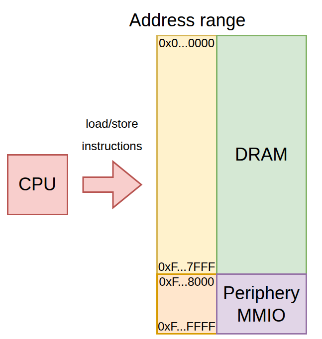

*Рисунок 1. Схема работы MMIO*

DMA - это механизм высокоскоростной передачи данных, в котором периферия читает/записывает данные напрямую в память (в общем случае), минуя процессор. Без DMA процессор исполнял бы инструкцию для каждого читаемого/записываемого слова, что отнимало бы огромное количество процессорного времени и в разы замедляло бы передачу данных, особенно для чтения. С DMA периферия может читать/писать в память в "потоковом" режиме, что позволяет добиваться гигабитных скоростей и ограничивает торможение процессора. В случае PCIe периферия исполняет DMA методом bus-mastering, то есть любое PCIe-устройство может стать мастер-девайсом как CPU и сам генерировать транзакции чтения/записи по адресам общей адресной шины. Мастером в конкретный момент времени может быть только одно устройство, поэтому существует арбитр, который ответственен за выбор мастер-девайса в конкретный момент времени.

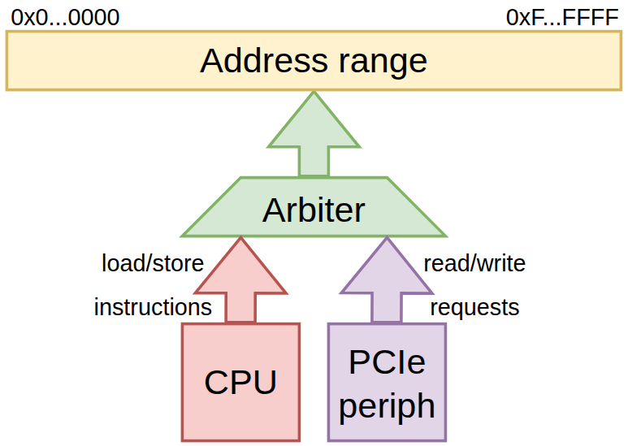

*Рисунок 2. Схема работы DMA*

Используя MMIO и DMA, можно спроектировать устройство, которое читает/пишет данные через DMA исключительно по командам процессора. Общий цикл можно описать следующим образом:
- Создается необходимое количества DMA-буферов необходимых размеров в памяти;
- Производится запись информации о DMA-задаче в MMIO-регистры периферии (тип операции (чтение/запись), стартовый адрес, количество байт и т. д.);
- Согласно полученным данным периферия создает задачу для внутреннего DMA-контроллера;
- Происходит чтение/запись напрямую в память (собственно DMA);
- По завершении выполнения DMA-задачи DMA-контроллер генерирует прерывание;
- ISR (Interrupt Service Routine) очищает прерывание записью в отведенный для этого MMIO-регистр. Цикл завершен.

С полученными знаниями об MMIO и DMA, можно приступить к пошаговому туториалу по разработке DMA-контроллера на ПЛИС.

### Пошаговый процесс разработки проекта

Процесс разработки можно разделить на 3 части:
- Интеграция IP-ядра 7 Series FPGAs Integrated Block for PCI Express (UG477), которое позволяет абстрагироваться от PHY (GTX трансиверов) и Data Link (кредитный flow control), давая работать с уровнем транзакций (PCIe TLP);
- Разработка моста (bridge), который преобразует TLP для MMIO-операций в APB-транзакции внутри ПЛИС для доступа к регистрам устройства, а TLP для DMA в AXI4-транзакции, на котором основан разработанный DMA-Engine;
- Разработка DMA-Engine (будет в части 2).

#### Интеграция IP-ядра

Используется ядро 7 Series FPGAs Integrated Block for PCI Express (UG477), которое является оберткой для трансиверов, к площадкам которого выводятся контакты PCIe разъема. Он реализовывает карту памяти PCIe-устройства, кредиты Flow Control и прочие детали стандарта. Интеграция этого IP-ядра будет разделена на 2 части:

- Создание инстанса IP-ядра;
- Подключение сигналов к IP-ядру.

##### Создание инстанса IP-ядра

На следующих картинах будут указаны параметры, которые были изменены при создании инстанса IP-ядра для этого проекта. Подробное описание всех параметров есть в документации UG477.

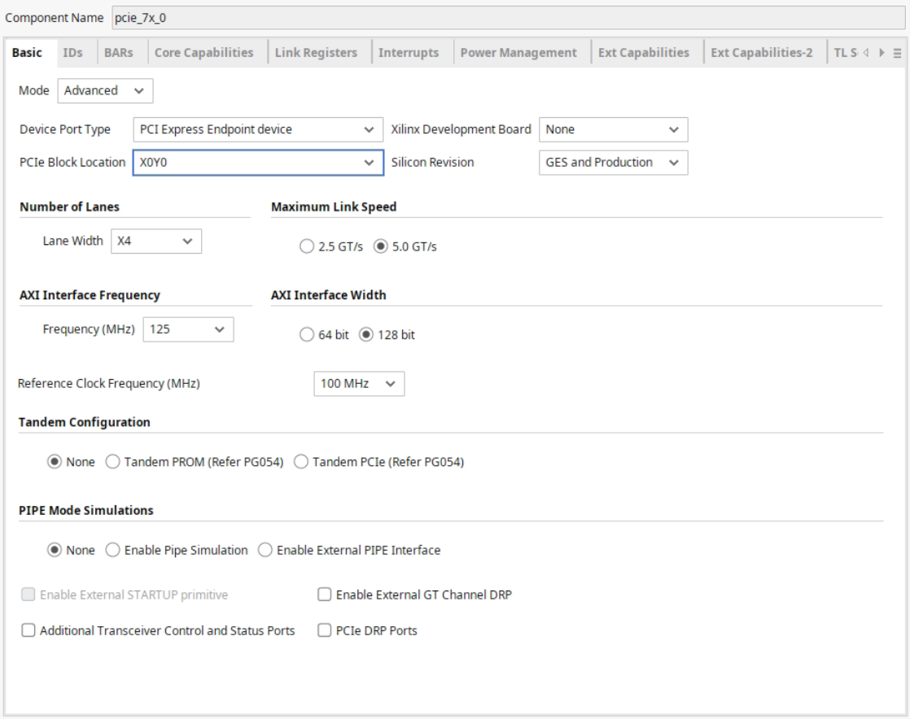

*Рисунок 3. Базовые параметры IP-ядра*

Базовые параметры позволяют выбрать тип девайса (Root Port или Endpoint), используемые трансиверы, конфигурацию PCIe, ширина и частота канала, через который передаются TLP в логику ПЛИС, референсный клок и прочие опции. Конфигурация для данного проекта:
- Device Port Type: Endpoint - данный проект реализует конечное устройство в сети PCIe;
- Lane Width и Maximum Link Speed: 4x и 5.0 GT/s реализуют соединение PCIe 2.0 x4;
- AXI Freq и AXI Interface Width: 125 MHz и 128 bit - TLP, передаваемые и принимаемые по AXI4-Stream транспортируются 128-битными словами на 125 МГц. Альтернативный вариант - 250 MHz и 64 bit, но на 250 MHz трудно сводить дизайн по таймингам.

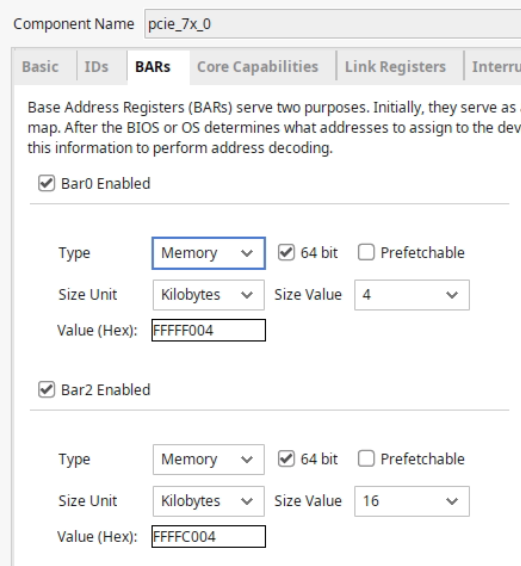

*Рисунок 4. Конфигурация BAR*

BAR - это MMIO-диапазоны, которые были описаны в принципе взаимодействия ПК и PCIe-периферии. В данном проекте были активированы BAR[0] размером в 4 КБайт и BAR[2] размером в 16 КБайт. В данных диапазонах расположены следующие регистровые пространства, с помощью которых ПК управляет DMA-Engine-ом:
- BAR[0]: MSI-X таблица, имплементирующая MSI-X прерывания;
- BAR[2]: CSR (control/status registers) для DMA-Engine - информация об устройстве (self-discovery), статус и снятие прерываний, генерация DMA-задач.

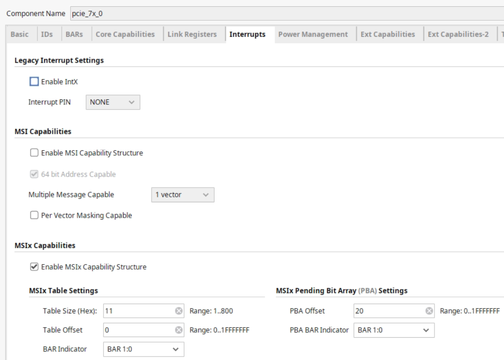

*Рисунок 5. Конфигурация прерываний*

PCIe не имеет выделенных линий для прерываний, поэтому для генерации прерываний девайс генерирует специальный TLP. Современные PCIe устройства могут поддерживать три типа прерываний:
- INTx: старые PCI шины имели 4 выделенные физические линии прерываний на шине (INTA, INTB, INTC, INTD). PCIe не имеет физических линий прерываний, но для сохранения совместимости с программной моделью PCI были стандартизированы специальные Message TLP, при получении которых PCIe система эмулирует поднятие одной из линий INTx;
- MSI и MSI-X: современный метод передачи прерываний сообщениями - для генерации прерывания PCIe устройство отправляет обычный Memory Write TLP по заранее определенному адресу с заранее определенными данными (обычно по данному адресу находится декодер MSI, например, IMSIC для RISC-V, который по полученному сообщению поднимает нужное прерывание в процессоре). MSI и MSI-X отличаются друг от друга по максимальному количеству прерываний на каждое устройство и по гибкости настройки.

В данном проекте был выбран MSI-X с возможностью выделить 17 прерываний (8 для DMA-прерываний, 8 для прочих, которые подключаются через специальный порт DMA-Engine, оставшийся - reserved). PBA не используется, поэтому единственное, что надо было сделать - это сместить его на адрес (0x20), который не пересекается с диапазоном MSI-X таблицы (0x00..0x11).

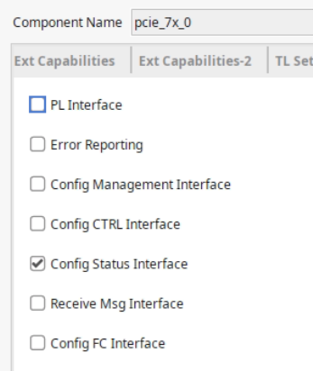

*Рисунок 6. Прочая конфигурация*

Данные настройки позволяют вывести в порты IP-ядра различные наборы сигналов для диагностики, link-реконфигурации и прочего. Единственный набор, который используется в данном проекте - это `Config Status Interface`, поскольку он содержит сигналы `cfg_bus_number[7:0]`, `cfg_device_number[4:0]`, `cfg_function_number[2:0]`, необходимые для формирования исходящих TLP.

С этими настройками IP-ядро было сгенерировано. Итоговый инстанс модуля имеет следующий (используемый) портлист:

```verilog
pcie_7x_0 u_pcie_7x_0 (
    .pci_exp_txp                  (), // Output [3:0]  : Исходящие PCIe диффпары (позитив)
    .pci_exp_txn                  (), // Output [3:0]  : Исходящие PCIe диффпары (негатив)
    .pci_exp_rxp                  (), // Input  [3:0]  : Входящие PCIe диффпары (позитив)
    .pci_exp_rxn                  (), // Input  [3:0]  : Входящие PCIe диффпары (негатив)
    .user_clk_out                 (), // Output        : Частота для пользовательской логики на ПЛИС
    .user_reset_out               (), // Output        : Сброс для пользовательской логики на ПЛИС
    .s_axis_tx_tready             (), // Output        : \
    .s_axis_tx_tdata              (), // Input  [127:0]: |
    .s_axis_tx_tkeep              (), // Input  [15:0] : | => AXI4-Stream для исходящих TLP
    .s_axis_tx_tlast              (), // Input         : |
    .s_axis_tx_tvalid             (), // Input         : |
    .s_axis_tx_tuser              (), // Input  [3:0]  : /
    .m_axis_rx_tdata              (), // Output [127:0]: \
    .m_axis_rx_tkeep              (), // Output [15:0] : |
    .m_axis_rx_tlast              (), // Output        : | => AXI4-Stream для входящих TLP
    .m_axis_rx_tvalid             (), // Output        : |
    .m_axis_rx_tready             (), // Input         : |
    .m_axis_rx_tuser              (), // Output [21:0] : /
    .sys_clk                      (), // Input         : Порт для референсного клока PCIe
    .sys_rst_n                    (), // Input         : Сброс PCIe (PERST)
    .cfg_bus_number               (), // Output [7:0]  : Для девайса 04:00.0 (мой пример) это 04
    .cfg_device_number            (), // Output [4:0]  : Для девайса 04:00.0 (мой пример) это 00
    .cfg_function_number          (), // Output [2:0]  : Для девайса 04:00.0 (мой пример) это 0
    .cfg_interrupt                (), // Input         : \
    .cfg_interrupt_assert         (), // Input         : |
    .cfg_interrupt_di             (), // Input  [7:0]  : | => Используется для INTx и MSI (не применяется в проекте)
    .cfg_interrupt_stat           (), // Input         : |
    .cfg_pciecap_interrupt_msgnum (), // Input  [4:0]  : /
    .pipe_txoutclk_out            (), // Output        : \
    .pipe_pclk_sel_out            (), // Output [3:0]  : |
    .pipe_pclk_in                 (), // Input         : |
    .pipe_rxusrclk_in             (), // Input         : |
    .pipe_rxoutclk_in             (), // Input  [3:0]  : |
    .pipe_dclk_in                 (), // Input         : | => Тактование GTX-трансиверов
    .pipe_userclk1_in             (), // Input         : |
    .pipe_userclk2_in             (), // Input         : |
    .pipe_oobclk_in               (), // Input         : |
    .pipe_mmcm_lock_in            (), // Input         : |
    .pipe_mmcm_rst_n              ()  // Input         : /
);
```
Неиспользуемые `output`-сигналы не выведены.

##### Подключение сигналов к IP-ядру

В используемой конфигурации IP-ядра трансиверы тактуются следующим образом:

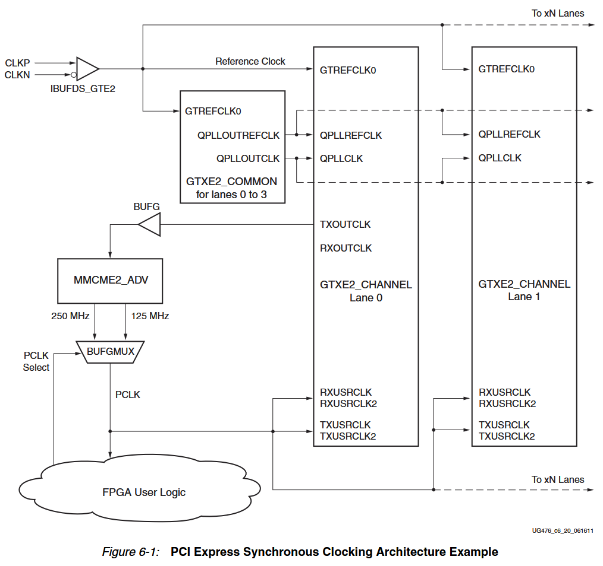

*Рисунок 7. Тактование трансиверов, используемых в IP-ядре (UG476)*

Прием PCIe-референсного клока (100 МГц) и PERST со входных портов и передача в IP-ядро (трансиверов):
```verilog
module kdma_toplevel (
    input  logic           clk_in_p   ,
    input  logic           clk_in_n   ,

    input  logic           sys_rst_n  ,
    ...
);
...
logic clk;
...

IBUFDS_GTE2 refclk_ibuf (.O(clk), .ODIV2(), .I(clk_in_p), .CEB(1'b0), .IB(clk_in_n));
...

pcie_7x_0 u_pcie_7x_0 (
...
    .sys_clk   (clk      ),
    .sys_rst_n (sys_rst_n),
...
);
```
`IBUFDS_GTE2` - это буфер для площадки референсного клока трансиверов, через выход которого клок передается в соотвествующие входные порты трансиверов.

`input logic sys_rst_n` подключается через простую I/O площадку, которую Vivado автоматически проводит через 

В текущей конфигурации IP-ядра QPLL (`GTXE2_COMMON`) генерируется автоматически внутри кода IP-ядра, поэтому его разводить в топлевеле не нужно было.

!!! note
    В процессе написания статьи узнал, что если бы я убрал галочку `Include Shared Logic (Clocking) in example design` во вкладке Shared Logic, то все, что описано далее, можно было бы пропустить, ибо это было бы сделано внутри IP-корки и не выводилось бы наружу. Например, галочка `Include Shared Logic (GT_COMMON) in example design` не стоит, поэтому QPLL-и генерируются автоматически в IP-корке, поэтому такие дела. Почти весь следующий код был взят с Example Design с минимально нужным уровнем понимания происходящего.

Далее описано создание Parallel Clock для трансиверов и клоков, отвечающих за создание `user_clk_out`:
```verilog
logic [3:0] pclk_sel_big_1, pclk_sel_big_2, pclk_sel_big_3;
logic       pclk_sel;

logic       mmcm_clk_buf;
logic       txoutclk_out;
logic       mmcm_lock;
logic       mmcm_fb     ;
logic       clk_125mhz, muxout  ;
logic       clk_250mhz  ;
logic       userclk1, userclk1_buf;
logic       userclk2, userclk2_buf;
logic       oobclk  ;
logic       dclk;
logic       mmcm_rst_n;

assign mmcm_rst_n = '1;

// 2FF-синхронизатор для сигнала выбора [rx/tx]usrclk_in ([RX/TX]USRCLK) клока
always_ff @(posedge muxout or negedge mmcm_rst_n) begin : blockName
    if (!mmcm_rst_n) begin
        pclk_sel_big_3 <= '0;
        pclk_sel_big_2 <= '0;
        pclk_sel       <= '0;
    end
    else begin
        pclk_sel_big_2 <= pclk_sel_big_1;
        pclk_sel_big_3 <= pclk_sel_big_2;

        if (&pclk_sel_big_3) begin
            pclk_sel <= '1;
        end
        else if (&(~pclk_sel_big_3)) begin
            pclk_sel <= '0;
        end
        else begin
            pclk_sel <= '1;
        end
    end
end

/*
txoutclk_out (TXOUTCLK) - источник Parallel Clock согласно схеме тактования выше,
выводится на глобальные линии для клоков через буфер BUFG
*/
BUFG mmcm_in_buf
(
    //---------- Input ---------------------------------
    .I                          (txoutclk_out), 
    //---------- Output --------------------------------
    .O                          (mmcm_clk_buf)
);

// Основной PLL для генерации Parallel Clock и прочих
MMCME2_ADV #
(
    .BANDWIDTH            ("OPTIMIZED"),
    .CLKOUT4_CASCADE      ("FALSE"),
    .COMPENSATION         ("ZHOLD"),
    .STARTUP_WAIT         ("FALSE"),
    .DIVCLK_DIVIDE        (1),
    .CLKFBOUT_MULT_F      (10), // Входящий клок умножается до 1 ГГц
    .CLKFBOUT_PHASE       (0.000),
    .CLKFBOUT_USE_FINE_PS ("FALSE"),
    .CLKOUT0_DIVIDE_F     (8),  // Получаем клок 125 МГц для [rx/tx]usrclk_in
    .CLKOUT0_PHASE        (0.000),
    .CLKOUT0_DUTY_CYCLE   (0.500),
    .CLKOUT0_USE_FINE_PS  ("FALSE"),
    .CLKOUT1_DIVIDE       (4),  // Получаем клок 250 МГц для [rx/tx]usrclk_in
    .CLKOUT1_PHASE        (0.000),
    .CLKOUT1_DUTY_CYCLE   (0.500),
    .CLKOUT1_USE_FINE_PS  ("FALSE"),
    .CLKOUT2_DIVIDE       (4),  // Получаем клок 250 МГц для usrclk1 (взято с примера)
    .CLKOUT2_PHASE        (0.000),
    .CLKOUT2_DUTY_CYCLE   (0.500),
    .CLKOUT2_USE_FINE_PS  ("FALSE"),
    .CLKOUT3_DIVIDE       (8),  // Получаем клок 125 МГц для usrclk2 (взято с примера, видимо источник user_clk_out)
    .CLKOUT3_PHASE        (0.000),
    .CLKOUT3_DUTY_CYCLE   (0.500),
    .CLKOUT3_USE_FINE_PS  ("FALSE"),
    .CLKOUT4_DIVIDE       (20),
    .CLKOUT4_PHASE        (0.000),
    .CLKOUT4_DUTY_CYCLE   (0.500),
    .CLKOUT4_USE_FINE_PS  ("FALSE"),
    .CLKIN1_PERIOD        (10), // Указываем, что частота входящего клока 100 МГц
    .REF_JITTER1          (0.010)
    
) mmcm_i (
    .CLKIN1                     (mmcm_clk_buf),
    .CLKIN2                     (1'd0),      
    .CLKINSEL                   (1'd1),
    .CLKFBIN                    (mmcm_fb),
    .RST                        (1'd0),
    .PWRDWN                     (1'd0), 
    
    //---------- Output ------------------------------------
    .CLKFBOUT                   (mmcm_fb),
    .CLKOUT0                    (clk_125mhz),
    .CLKOUT1                    (clk_250mhz),
    .CLKOUT2                    (userclk1),
    .CLKOUT3                    (userclk2),
    .CLKOUT4                    (oobclk),
    .CLKOUT5                    (),
    .CLKOUT6                    (),
    .LOCKED                     (mmcm_lock)

);

/*
Клоковый мультиплексор для [rx/tx]usrclk_in согласно схеме тактования выше,
сигнал выбора предоставлен самим IP-ядром
*/
BUFGCTRL pclk_i1
(
    //---------- Input ---------------------------------
    .CE0                        (1'd1),         
    .CE1                        (1'd1),        
    .I0                         (clk_125mhz),   
    .I1                         (clk_250mhz),   
    .IGNORE0                    (1'd0),        
    .IGNORE1                    (1'd0),        
    .S0                         (~pclk_sel),    
    .S1                         ( pclk_sel),    
    //---------- Output --------------------------------
    .O                          (muxout)
);

// Вывод всех остальных полученных клоков на глобальные линии через BUFG
BUFG usr1 (.O(userclk1_buf), .I(userclk1));
BUFG usr2 (.O(userclk2_buf), .I(userclk2));
BUFG dclkbuf (.O(dclk), .I(clk_125mhz));

pcie_7x_0 u_pcie_7x_0 (
...
    .pipe_txoutclk_out (txoutclk_out  ),
    .pipe_pclk_sel_out (pclk_sel_big_1),
    .pipe_pclk_in      (muxout        ),
    .pipe_rxusrclk_in  (muxout        ),
    .pipe_rxoutclk_in  ('0            ),
    .pipe_dclk_in      (dclk          ),
    .pipe_userclk1_in  (userclk1_buf  ),
    .pipe_userclk2_in  (userclk2_buf  ),
    .pipe_oobclk_in    (muxout        ),
    .pipe_mmcm_lock_in (mmcm_lock     ),
    .pipe_mmcm_rst_n   (mmcm_rst_n    )
);
```

Далее идет описание подключение линий данных к IP-ядру.

Подключение RX и TX пинов PCIe к IP-ядру:
```verilog
module kdma_toplevel (
...
    output logic           pci_exp_tx0_p,
    output logic           pci_exp_tx0_n,
    output logic           pci_exp_tx1_p,
    output logic           pci_exp_tx1_n,
    output logic           pci_exp_tx2_p,
    output logic           pci_exp_tx2_n,
    output logic           pci_exp_tx3_p,
    output logic           pci_exp_tx3_n,

    input  logic           pci_exp_rx0_p,
    input  logic           pci_exp_rx0_n,
    input  logic           pci_exp_rx1_p,
    input  logic           pci_exp_rx1_n,
    input  logic           pci_exp_rx2_p,
    input  logic           pci_exp_rx2_n,
    input  logic           pci_exp_rx3_p,
    input  logic           pci_exp_rx3_n
);
...

logic [3:0] pci_exp_txp;
logic [3:0] pci_exp_txn;
logic [3:0] pci_exp_rxp;
logic [3:0] pci_exp_rxn;

assign pci_exp_txp = {pci_exp_tx3_p, pci_exp_tx2_p, pci_exp_tx1_p, pci_exp_tx0_p};
assign pci_exp_txn = {pci_exp_tx3_n, pci_exp_tx2_n, pci_exp_tx1_n, pci_exp_tx0_n};
assign pci_exp_rxp = {pci_exp_rx3_p, pci_exp_rx2_p, pci_exp_rx1_p, pci_exp_rx0_p};
assign pci_exp_rxn = {pci_exp_rx3_n, pci_exp_rx2_n, pci_exp_rx1_n, pci_exp_rx0_n};
...

pcie_7x_0 u_pcie_7x_0 (
    .pci_exp_txp                  (pci_exp_txp)        ,
    .pci_exp_txn                  (pci_exp_txn)        ,
    .pci_exp_rxp                  (pci_exp_rxp)        ,
    .pci_exp_rxn                  (pci_exp_rxn)        ,
...
);
```

Вывод пользовательских сигналов клока и сброса, cfg_[bus/device/function]_number и интерфейсов AXI4-Stream для их дальнейшего подключения к мосту + DMA-Engine:
```verilog
logic           user_clk_out    ;
logic           user_reset_out  ;
logic           user_resetn_out ;

logic           s_axis_tx_tready;
logic [127 : 0] s_axis_tx_tdata ;
logic [ 15 : 0] s_axis_tx_tkeep ;
logic           s_axis_tx_tlast ;
logic           s_axis_tx_tvalid;

logic [127 : 0] m_axis_rx_tdata ;
logic [15 : 0]  m_axis_rx_tkeep ;
logic           m_axis_rx_tlast ;
logic           m_axis_rx_tvalid;
logic           m_axis_rx_tready;
logic [21 : 0]  m_axis_rx_tuser ;

logic [4:0]     m_axis_sof    ;
logic [4:0]     m_axis_eof    ;
logic [4:0]     m_axis_bar_hit;

assign user_resetn_out = ~user_reset_out; // Инверсия позитивного сброса

assign m_axis_sof     = m_axis_rx_tuser[14:10];
assign m_axis_eof     = m_axis_rx_tuser[21:17];
assign m_axis_bar_hit = m_axis_rx_tuser[9:2];

logic [7:0] cfg_bus_number     ;
logic [4:0] cfg_device_number  ;
logic [2:0] cfg_function_number;

pcie_7x_0 u_pcie_7x_0 (
...
    .user_clk_out                 (user_clk_out       ),
    .user_reset_out               (user_reset_out     ), // Этот сброс - позитивный
    .s_axis_tx_tready             (s_axis_tx_tready   ),
    .s_axis_tx_tdata              (s_axis_tx_tdata    ),
    .s_axis_tx_tkeep              (s_axis_tx_tkeep    ),
    .s_axis_tx_tlast              (s_axis_tx_tlast    ),
    .s_axis_tx_tvalid             (s_axis_tx_tvalid   ),
    .s_axis_tx_tuser              ('0                 ), // Не используется
    .m_axis_rx_tdata              (m_axis_rx_tdata    ),
    .m_axis_rx_tkeep              (m_axis_rx_tkeep    ),
    .m_axis_rx_tlast              (m_axis_rx_tlast    ),
    .m_axis_rx_tvalid             (m_axis_rx_tvalid   ),
    .m_axis_rx_tready             (m_axis_rx_tready   ),
    .m_axis_rx_tuser              (m_axis_rx_tuser    ),
...
    .cfg_bus_number               (cfg_bus_number     ),
    .cfg_device_number            (cfg_device_number  ),
    .cfg_function_number          (cfg_function_number),
    .cfg_interrupt                ('0                 ),
    .cfg_interrupt_assert         ('0                 ),
    .cfg_interrupt_di             ('0                 ),
    .cfg_interrupt_stat           ('0                 ),
    .cfg_pciecap_interrupt_msgnum ('0                 ),
...
);
```
- Тактовый `user_clk_out` тактует мост + DMA-Engine, а инвертированный `user_reset_out` является внешним (системным) ресетом для моста + DMA-Engine;
- `cfg_*` сигналы были описаны выше;
- `s_axis_tx_*` является стандартным AXI4-Stream, в котором `s_axis_tx_tuser` позволяет отправлять следующие сигналы:
    - `s_axis_tx_tuser[3]` (`t_src_dsc`) - досрочное прерывание транзакции (не используется);
    - `s_axis_tx_tuser[2]` (`tx_str`) - потоковая передача данных без прерываний, т. е. на протяжении текущего TLP `s_axis_tx_tvalid` всегда 1 (не используется);
    - `s_axis_tx_tuser[1]` (`tx_err_fwd`) - текущий TLP "отравлен" ошибкой (не используется);
    - `s_axis_tx_tuser[0]` (`tx_ecrc_gen`) - сгенерировать ECRC и добавить его в конец TLP (не используется);
- `m_axis_rx_*` является AXI4-Stream, однако в конфигурации с шириной слова 128-бит, как в этом проекте, для сигнализации начала/конца TLP используется не `m_axis_rx_tlast`, а некоторые слайсы `m_axis_rx_tuser` `m_axis_rx_tuser` позволяет отправлять следующие сигналы:
    - `m_axis_rx_tuser[14:10]` (`rx_is_sof[4:0]`) - `rx_is_sof[4] == 1` когда начался новый TLP. `rx_is_sof[3:0]` сигнализирует байт, с которого начался TLP;
    - `m_axis_rx_tuser[21:17]` (`rx_is_eof[4:0]`) - `rx_is_eof[4] == 1` когда TLP закончился. `rx_is_eof[3:0]` сигнализирует байт, на котором закончился TLP;
    - `m_axis_rx_tuser[9:2]` (`rx_bar_hit[7:0]`) - если целевой адрес входящего TLP попадает в какие-то из диапазонов BAR, то соответствующие биты становится 1:
        - `rx_bar_hit[0]` - BAR0;
        - `rx_bar_hit[1]` - BAR1;
        - `rx_bar_hit[2]` - BAR2;
        - `rx_bar_hit[3]` - BAR3;
        - `rx_bar_hit[4]` - BAR4;
        - `rx_bar_hit[5]` - BAR5;
        - `rx_bar_hit[6]` - Expansion ROM Address;
    - `m_axis_rx_tuser[1]` (`rx_err_fwd`) - входящий TLP помечен источником как "отравленный" ошибкой (игнорируется);
    - `m_axis_rx_tuser[0]` (`rx_ecrc_err`) - для входящего TLP была обнаружена ошибка на основе расчета ECRC (игнорируется).

!!! note
    Обычно нехорошо игнорировать сигналы ошибок, но это университетский проект, который должен как-нибудь работать, а не проект для бизнеса, который надо протестировать вдоль и поперек. По этим причинам я предположил, что такие ошибки - это астрономически маловероятные события, постучал по дереву и пошел.


#### Мост PCIe TLP (AXI4-Stream) to AXI4-MM/APB3

Планируемый DMA-контроллер имеет отдельный AXI4-master интерфейс для каждого из DMA-каналов, через который совершаются DMA-операции, а также имеет по одному APB3-slave интерфейсу на каждый BAR, через которые производятся доступы ко внутренним регистрам. Мост должен связывать DMA-Engine и IP-ядро таким образом, чтобы DMA-engine беспрепятственно совершал DMA-операции, а хост беспрепятственно обращался к регистрам устройства.

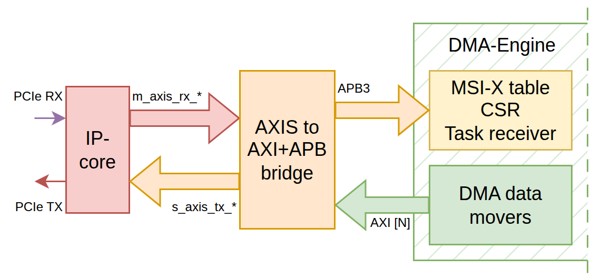

*Рисунок 8. Высокоуровневая схема системы (N в `AXI [N]` - это количество DMA каналов)*

##### Анализ возможных типов PCIe TLP

Стандарт PCIe описывает множество типов TLP, однако для поддержания функциональности системы необходима поддержка лишь некоторых из них:

- TLP от хоста в ПЛИС:
    - Memory write posted TLP - запись данных в регистр;
    - Memory read non-posted TLP - запрос на чтение данных из регистра;
    - CPLD (Completion data) TLP - данные, пришедшие в ответ на запрос на чтение, которая была отправлена хосту для выполнения операции DMA-чтения;
- TLP от ПЛИС в хост:
    - Memory write posted TLP - запись данных в рамках операции DMA-записи;
    - Memory read non-posted TLP - запрос на чтение данных в рамках операции DMA-чтения;
    - CPLD (Completion data) TLP - данные, отправленные в ответ на запрос на чтение из регистра;
    - CPL (Completion) TLP - пакет с кодом ошибки, который генерируется в следующих случаях:
        - Пришел пакет с неопознанным хедером;
        - Пришел запрос на чтение по адресу, который пересекает 16-байтовую границу.

Все приведенные типы пакетов имеют хедер одного из следующих трех типов:

- Тип 1 - Memory read/write с 32-битным адресом (3-DW хедер):

    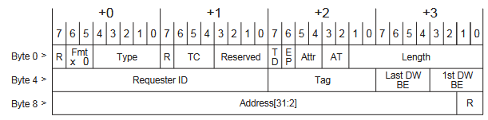
- Тип 2 - Memory read/write с 64-битным адресом (4-DW хедер):

    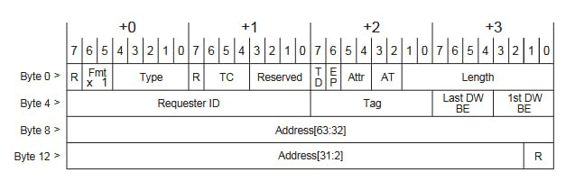
- Тип 3 - CPL/CPLD хедер (3-DW хедер):

    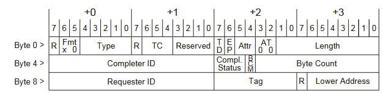

Если TLP имеет данные (payload), то они идут DWORD-ами сразу после хедера без пробелов:
```
          3-DW header  4-DW header
          -----------  -----------
Byte 0  >  Header DW0   Header DW0
Byte 4  >  Header DW1   Header DW1
Byte 8  >  Header DW2   Header DW2
Byte C  >    Data DW0   Header DW3
Byte 10 >    Data DW1     Data DW0
Byte 14 >    Data DW2     Data DW1
Byte 18 >    Data DW3     Data DW2
Byte 1С >    Data DW4     Data DW3
...               ...          ...
```

За деталями значения полей в различных типах TLP можно обратиться к спецификации PCIe 2.0 (архив - https://dn760103.eu.archive.org/0/items/os-dev-manuals/pcie%20spec%20rev%202.0.pdf). Для распознавания типа пакета ключевыми являются поля Fmt и Type.

| `{Fmt, Type}` | Тип пакета |
| ------------- | ---------- |
| `00 00000`    | RD_32      |
| `01 00000`    | RD_64      |
| `10 00000`    | WR_32      |
| `11 00000`    | WR_64      |
| `00 01010`    | CPL        |
| `10 01010`    | CPLD       |

Глоссарий по важным полям хедера типов 1 и 2:
- Length - это количество записываемых/запрашиваемых для чтения DWORD-ов;
    - `10'h001` = 1 DW;
    - `10'h002` = 2 DW;
    - ...
    - `10'h3FF` = 1023 DW;
    - `10'h000` = 1024 DW.
- 1st DW BE - это byte-enable для 1-го data DW, Last DW BE - это byte-enable для последнего data DW;
- Можно отправить несколько Memory read без ожидания завершения предыдущих, но поле Tag для каждого из них должно быть уникально. Для Memory write поле Tag игнорируется;
- Для отправляемых от ПЛИС до хоста TLP поле Requester ID должно быть равно `{cfg_bus_number, cfg_device_number, cfg_function_number}`.

Глоссарий по важным полям хедера типа 3:
- Поле Compl. Status:
    | Compl. Status   | Значение                                                          |
    | --------------- | ---------                                                         |
    | `000 (STS_SC)`  | Success Completion - Успех                                        |
    | `001 (STS_UR)`  | Unsupported Request - входящий TLP данного типа не поддерживается |
    | `010 (STS_CRS)` | Должен генерироваться только IP-ядром |
    | `100 (STS_CA)`  | Completer Abort - входящий TLP данного типа поддерживается, но что-то нарушило программную модель устройства (пример - чтение по некорректному адресу) |

    Если статус `STS_SC`, то после хедера следуют данные;
- Length - это количество DWORD-ов данных в текущем TLP. Byte Count - количество еще недоставленных байт с учетом данных в текущем TLP:
    - На один Memory read может прийти несколько TLP, поэтому есть поле Byte Count. Пример:
        ```
        Single completion TLP:

        3-DW CPLD header > Length = 20, Byte Count = 80;
        Data DW0         > Data;
        Data DW1         > Data;
        Data DW2         > Data;
        ...
        Data DW19        > Data;
        

        Multiple completion TLPs:

        3-DW CPLD header > Length = 5, Byte Count = 80;
        Data DW0         > Data;
        Data DW1         > Data;
        Data DW2         > Data;
        ...
        Data DW5         > Data;
        
        3-DW CPLD header > Length = 10, Byte Count = 60;
        Data DW0         > Data;
        Data DW1         > Data;
        Data DW2         > Data;
        ...
        Data DW10        > Data;

        3-DW CPLD header > Length = 5, Byte Count = 20;
        Data DW0         > Data;
        Data DW1         > Data;
        Data DW2         > Data;
        ...
        Data DW5         > Data;
        ```
    - Если статус отличается от `STS_SC`, то Length игнорируется, но Byte Count должен показывать количество недоставленных данных, даже если никаких данных не было отправлено;
- При формировании CPL/CPLD от ПЛИС к хосту поле Completer ID должно быть равно `{cfg_bus_number, cfg_device_number, cfg_function_number}`;
- При формировании CPL/CPLD от ПЛИС к хосту поле Requester ID должно быть равно значению поля Requester ID того TLP, которое затриггерило формирующийся CPL/CPLD. То же самое для поля Tag.

##### Нюансы передачи PCIe TLP по AXI4-Stream интерфейсам IP-ядра

Разобрав типа PCIe TLP, которые необходимо поддерживать, надо уточнить, как именно эти TLP должны передаваться от и к IP-ядру. Разбор будет проводиться на примере 128-битных слов, используемых в проекте.

Общие особенности:
- DWORD-ы внутри 128-битного слова располагаются согласно Big-Endian. Внутри каждого DWORD байты располагаются согласно Little-Endian:

    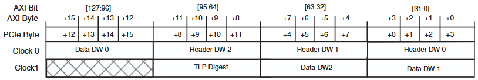

Передача TLP от ПЛИС к хосту по `s_axis_tx_*`:
- Передача всегда начинается от нулевого байта `s_axis_tx_tdata`;
- Для последнего слова транзакции выставляется `s_axis_tx_tlast = 1` и `s_axis_tx_tkeep` в соответствии с тем, сколько DWORD-ов осталось передать. Пример:
    ```
    `s_axis_tx_tdata` | H3 H2 H1 H0 | D3 D2 D1 D0 | X X X D4 |
    `s_axis_tx_tlast` | 0           | 0           | 1        |
    `s_axis_tx_tkeep` | FFFF        | FFFF        | 000F     |
    ```

Передача TLP от хоста в ПЛИС по `m_axis_rx_*`:
- Для обозначения начала и конца TLP используются  `m_axis_rx_tuser[14:10]` (`rx_is_sof[4:0]`) и `m_axis_rx_tuser[21:17]` (`rx_is_eof[4:0]`). TLP может начаться с 0-го байта (начало) или с 8-го байта (середина). Закончиться может на любом. Примеры:
    ```
    H* - какой-то DWORD хедера;
    D* - какой-то DWORD данных;

    Стандартное начало
    `m_axis_rx_tdata[127:0]` | H3 H2 H1 H0 | D3 D2 D1 D0 | X X X D4 |
    `rx_is_sof[4:0]        ` | 10          | 0X          | 0X       |
    `rx_is_eof[4:0]        ` | 0X          | 0X          | 03       |
    `rx_bar_hit[7:0]       ` | TLP0        | TLP0        | TLP0     |

    Начало посередине
    `m_axis_rx_tdata[127:0]` | H1 H0 X X | D1 D0 H3 H2 | X D4 D3 D2 |
    `rx_is_sof[4:0]        ` | 18        | 0X          | 0X         |
    `rx_is_eof[4:0]        ` | 0X        | 0X          | 1B         |
    `rx_bar_hit[7:0]       ` | TLP0      | TLP0        | TLP0       |

    Конец предыдущего TLP и начало следующего происходит в один такт (straddled)
    `m_axis_rx_tdata[127:0]` | H3 H2 H1 H0 | H1 H0 D1 D0 | D1 D0 H3 H2 | X D4 D3 D2 |
    `rx_is_sof[4:0]        ` | 10          | 18          | 0X          | 0X         |
    `rx_is_eof[4:0]        ` | 0X          | 17          | 0X          | 1B         |
    `rx_bar_hit[7:0]       ` | TLP0        | TLP1        | TLP1        | TLP1       |
    ```
- Обратите внимание, что для straddled-случая в такт смены TLP `rx_bar_hit[7:0]` показывает попадание в BAR для уже нового TLP, хотя 128-битное слово содержит часть старого TLP.

Для удобства дальнейшей расшифровки входящие TLP были преобразованы с помощью модулей `rtl/src/pcie_axi_bridge/kdma_pcie_destraddle.sv` и `rtl/src/pcie_axi_bridge/kdma_pcie_header_detacher.sv`:
- `kdma_pcie_destraddle` - избавляет от straddled TLP, пройдя через него все пакеты начинаются с 0 байта;
- `kdma_pcie_header_detacher` - отделяет data DWORDS от header DWORDS, так что после него вне зависимости от того, пришел 3-DW хедер или 4-DW хедер, любой TLP начинается чисто с хедера, а все данные начинаются только со следующего слова. TLP с 4-DW хедером в итоге не меняются, а для TLP с 3-DW хедером все данные сдвигаются на 1 DWORD.

##### Декодер входящих TLP

План действий в зависимости от типа TLP:
- Memory read/write 32/64:
    - Если доступ не поддерживается, то генерируется CPL TLP со статусом `Completer Abort` (примеры - сочетание длины и адреса пересекает 16 байт, используются BE поля);
    - Если транзакция поддерживаема, то активируется APB3 PSEL на выбранном из BAR согласно сигналу `bar_hit`;
    - Если транзакция записи, то после успешной APB3-транзакции цикл завершается;
    - Если транзакция чтения, то после успешной APB3-транзакции генерируется CPLD TLP, с помощью которого передаются данные операции чтения;
    - Для генерации CPL/CPLD пакетов предварительно запоминаются входящие Tag, Requester ID и прочие поля, необходимые для формирования ответа;
    - Во время всего цикл обработки данных пакетов `axis_tready` выставляется в 0, чтобы не волноваться об обработке новых данных.
- CPLD:
    - CPLD приходят в ответ на отправленные запросы чтения в рамках операций DMA-чтения, и в этом есть несколько нюансов:
        - Для повышения производительности чтения необходимо ввести поддержку конвейеризации, которая заключается в отправке нескольких запросов на чтение без ожидания завершения предыдущих;
        - Ранее было указано, что для каждой новой транзакции чтения их Tag не должен совпадать с теми, которые уже в обработке;
        - По правилам транспортировки TLP в PCIe, CPLD-пакеты с разными Tag могут переупорядочиваться;
    - Указанные выше нюансы говорят о том, что если планируется отдавать прочитанные данные в DMA-Engine с сохранением упорядоченности, то данные этих TLP нельзя отдавать сразу. Необходимо их перенаправлять в накопительные очереди, каждая из которых соответствует своему Tag, а специальная логика, запоминающая порядок запросов от DMA-Engine и отвечающая за обратное переупорядочивание, будет управлять потоками данных от этих очередей до DMA-Engine;
    - Каждый из M каналов DMA-Engine имеет свою независимую конвейеризацию глубиной в N запросов. Таким образом, возможно `N*M` одновременных запросов чтения в обработке, что требует `N*M` уникальных значений Tag, для каждого из которых нужна своя очередь. Для данного проекта (глубина конвейера в 4 запроса и 8 каналов DMA) необходимы 32 накопительные очереди;
    - FSM следит за содержимым CPLD-хедера входящего TLP, чтобы при записи последнего слова в какой-либо из DMARD пометить его специальным битом, аналогичным по смыслу `tlast`;

Обработчик входящих TLP реализован в виде конечного автомата, с нюансами реализации которого можно ознакомиться в rtl/src/pcie_axi_bridge/kdma_pcie_tlp_decoder.sv.

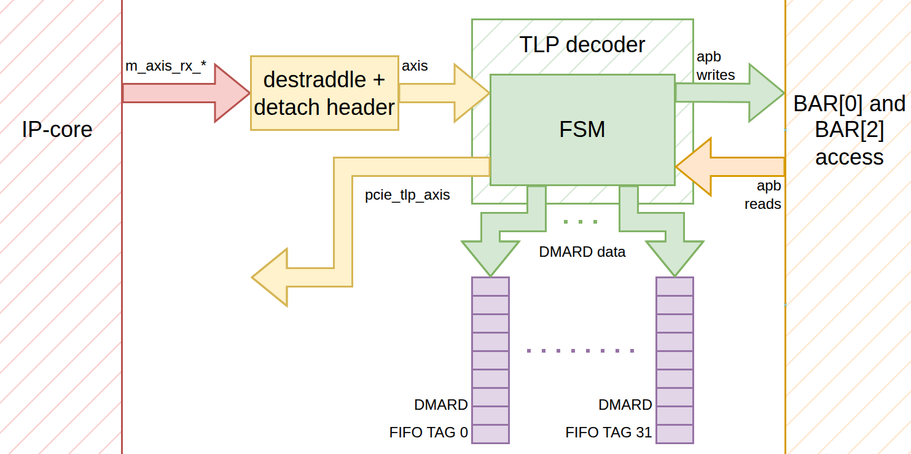

*Рисунок 9. Иллюстрация подключения TLP-декодера с обозначенными потоками данных*

##### Обработчик исходящих запросов на чтение

Источником исходящих запросов на чтение является DMA-Engine, а именно - `AR`-каналы AXI4-MM-интерфейсов. `AR`-канал передает информацию о начальном адресе и количестве слов, которые необходимо прочитать, что дает информацию для формирования исходящего Memory read TLP. Для каждой отправленной `AR`-команды DMA-Engine ждет прочитанных данных по `R`-каналу. Каждый канал использует возможности конвейеризации через `arid` сигнал - если для запрашиваемого `arid` в текущий момент нет транзакции в обработке, то запрос будет отправлен сразу, иначе будет ожидание окончания прошлой транзакции с этим `arid`. Возможные значения `arid` - 0..(N-1), где N - глубина конвейера.

Модуль `rtl/src/pcie_axi_bridge/kdma_dmard_ctrl.sv` отдельно управляет `AR` и `R` каналами для каждого DMA-канала, отправляя соответствующие Memory read TLP и управляя потоками данных между DMARD FIFO и `R`-каналами DMA-Engine. Общий принцип работы следующий:
- При получении `AR`-запроса и успешной его отправке в сторону IP-ядра, модуль помечает использованный `arid` как занятый, а также записывает его во внутреннюю очередь для запоминания порядка запросов. PCIe Tag формируется из `arid` следующим образом: `Tag = (DMA_CHANNEL_NUMBER << (arid_bit_width)) | arid`. Это значит, что хоть разные DMA-каналы и используют одни и те же значения AXI ID, их PCIe Tag-и не пересекаются, поэтому для каждого DMA-канала можно организовать свой конвейер со своим списком занятых ID и своей очередью запросов;
- Параллельно с этим на основе внутренней очереди ID модуль выбирает, из какого DMARD FIFO передавать данные в `R`-канал DMA-Engine. Если модуль заметил, что прошло последнее слово ожидаемого ID, то элемент очереди ID извлекается, появляется новый ID согласно порядку, и, соответственно, переключается очередь. Эта система позволяет совершать обратное переупорядочивание, и данные в DMA-Engine приходят строго в порядке запросов.

Описанный процесс происходит параллельно для всех DMA-каналов.

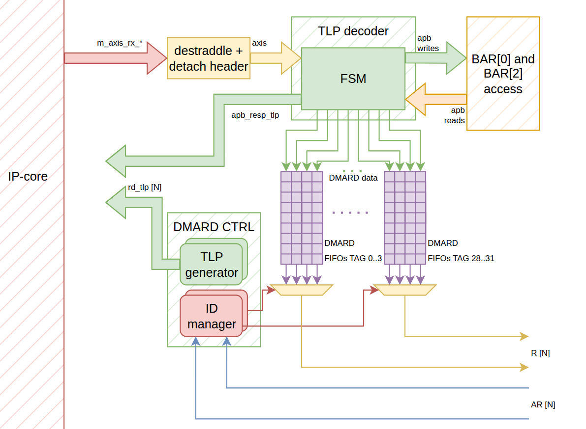

*Рисунок 10. Иллюстрация подключения DMARD-CTRL с управлением потоками данных очередей*

##### Обработчик исходящих запросов на запись

Обработка исходящих транзакций записи идет от DMA-Engine по AXI4-MM запросом по `AW`-каналу, передачей данных по `W`-каналу, а в конце DMA-Engine получает ответ по `B`-каналу. Модуль rtl/src/pcie_axi_bridge/kdma_dmawr_sink.sv отвечает за прием транзакций по `AW`/`W`-каналам и за передачу ответа по `B`-каналу.
- С операциями записи все намного проще, поскольку она не требует переупорядочиваний по ID, так что DMAWR CTRL может в потоковом режиме преобразовывать AXI-транзакции в PCIe Memory Write TLP;
- Стандартные Memory Write TLP являются Posted, то есть после их отправки никакой ответный CPL/CPLD пакет не приходит. В таком случае можно возвращать ответ по `B`-каналу сразу после получения и передачи данных по `AW`/`W`-каналам.

Описанный процесс происходит параллельно для всех DMA-каналов.

Также был добавлен отдельно AXI-канал для приема MSI-X сообщений (модуль rtl/src/pcie_axi_bridge/kdma_msix_bridge.sv). Теоретически это можно было сделать внутри DMAWR CTRL, но я вынес это в отдельный модуль чтобы не грязнить DMAWR CTRL логикой для `WSTRB`.

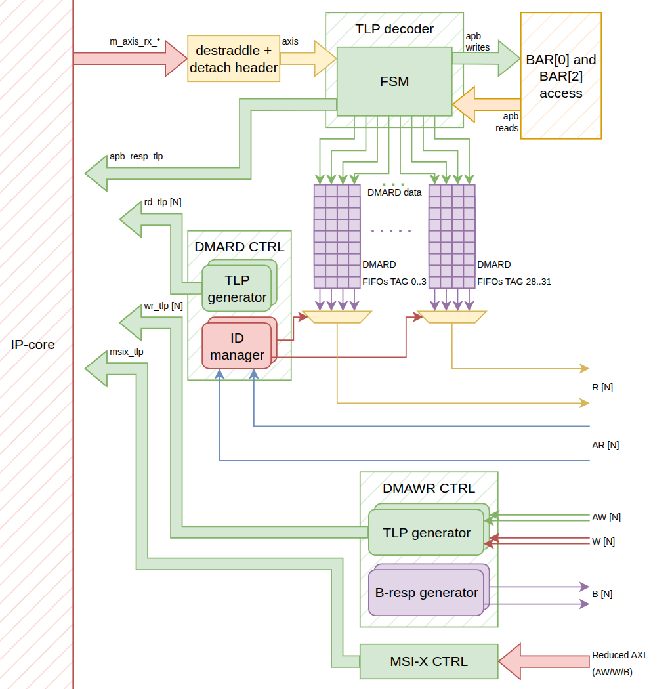

*Рисунок 11. Иллюстрация подключения DMAWR-CTRL и MSI-X CTRL*

##### Арбитрация TLP-потоков

TLP decoder, DMARD CTRL, DMAWR CTRL и MSI-X CTRL одновременно отдают PCIe TLP по своим каналам, но передавать IP-ядру их необходимо по очереди. Все PCIe TLP потоки передаются согласно портлисту `s_axis_tx_*` IP-ядра, т. е. они включают в себя сигнал `tlast`. Можно использовать блокирующие арбитры (rtl/src/lib/hs_wrmhl_arbiter.sv), которые после выбора канала ожидают слова с `tlast` для перехода на следующий канал, что позволяет организовать непрерывность на уровне отдельных TLP. Установив по арбитру на `rd_tlp` и `wr_tlp`, а потом собрав их выходы с `arb_resp_tlp` и `msix_tlp`, получается каскадная структура, которая позволяет транспортировать все TLP к IP-ядру. Внедрив эти арбитры, структура всего PCIe TLP (AXI4-Stream) to AXI4-MM/APB3 моста завершается.

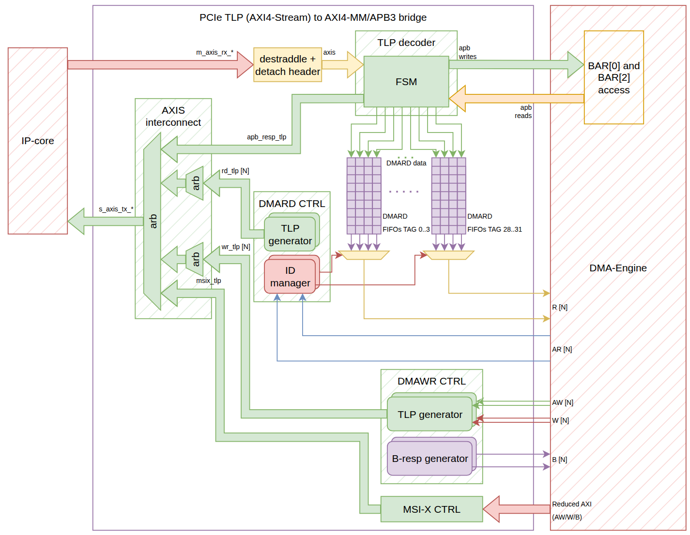

*Рисунок 11. Сборка AXIS interconnect для организации транспортировки исходящих TLP. N - количество DMA каналов*

## Что дальше?

Во второй части будут описаны строение и принцип работы DMA-контроллера, а также принцип работы драйвера, который для него был написан. Надеюсь, вам понравилась моя первая статья и будете ждать вторую часть!

## Источники
- https://dn760103.eu.archive.org/0/items/os-dev-manuals/pcie%20spec%20rev%202.0.pdf - архив спецификации PCIe 2.0;
- https://docs.amd.com/v/u/en-US/ug477_7Series_IntBlock_PCIe - юзер гайд 7 Series FPGAs Integrated Block for PCI Express (UG477);
- https://docs.amd.com/v/u/en-US/ug476_7Series_Transceivers - юзер гайд 7 Series FPGAs GTX/GTH Transceivers (UG476);
- https://github.com/apoj-inc/Kintex-7-PCIe-DMA - репозиторий с проектом.