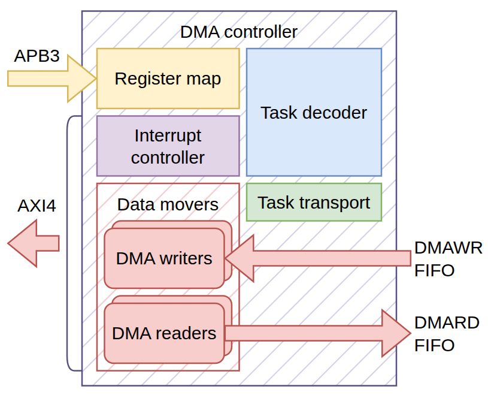
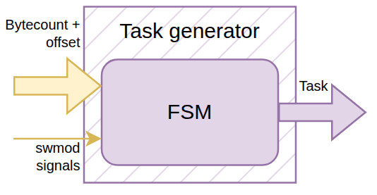
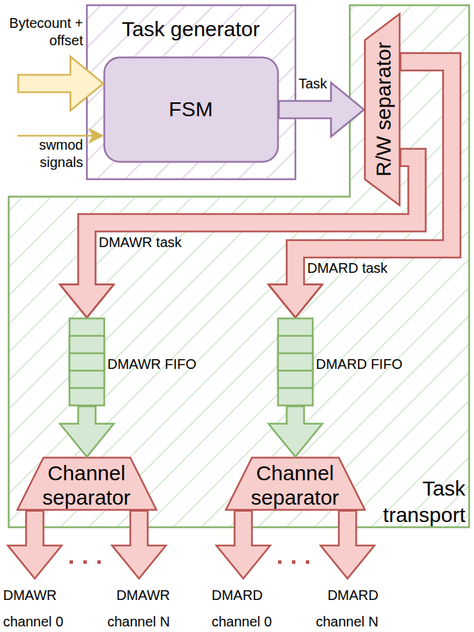
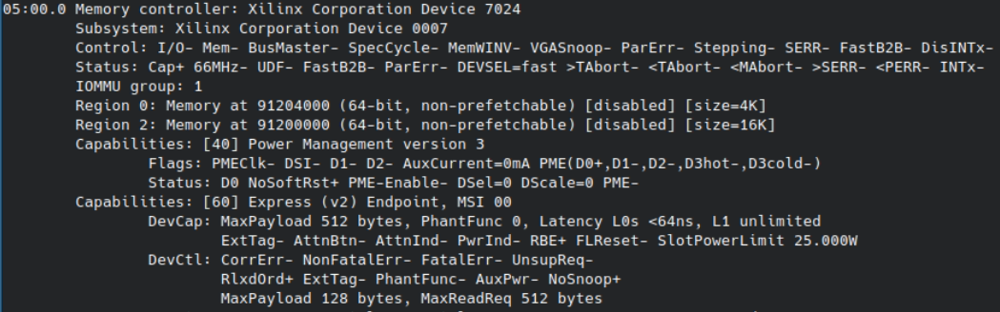
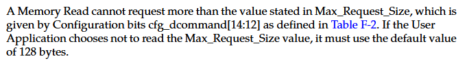
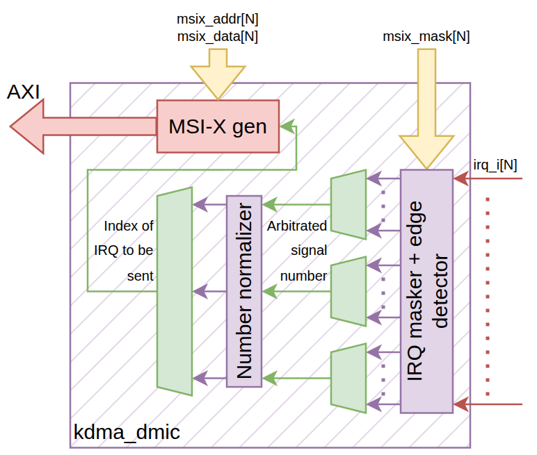

# Разработка 8-канального DMA для PCIe своими руками - часть 2

> автор: *Талибов Сэрхан, Junior RTL developer, играю с FPGA в универе*

## Глоссарий

Я рассчитываю, что вы знаете, что такое ПЛИС/FPGA, RTL и Verilog.

- DWORD (DW) - 32-битное слово;
- QWORD (QW) - 64-битное слово;
- IP-ядро - готовый компонент, предоставляемый некоторым вендором и реализующий определенную функцию;
- Трансивер (Transceiver) - в контексте FPGA это аппаратный блок, реализующий приемопередачу последовательного потока данных на гигагерцовой частоте. Одна из основных функций - сериализация и десерализация данных для того, чтобы FPGA логика могла работать с ними в мегагерцовых частотах;
- DMA (Direct Memory Access) - чтение/запись данных напрямую в память из периферии, минуя центральный процессор. Многоканальный DMA - метод имплементации, благодаря которому через один и тот же линк можно "параллельно" совершать независимые друг от друга DMA-операции;
- MMIO (Memory Mapped Input/Output) - метод предоставления доступа к регистрам периферии путем их внедрения в общее адресное пространство;
- PCIe - один из наиболее популярных стандартов для подключения высокоскоростной периферии к современным ПК. Является дуплексным последовательным протоколом с возможностью параллельного подключения нескольких линий (мультканальная последовательная передача данных);
- Уровень абстракции - метод представления протокола связи, позволяющий не углубляться в низкоуровневые детали имплементации. Примеры:
    - Physical layer: PCIe является дуплексным последовательным интерфейсом, использующий LVDS для сигналов;
    - Data link layer: PCIe 2.0 кодирует данные 8/10bit методом; игнорирует детали реализации физического уровня;
    - Transaction layer: PCIe передает TLP (Transaction Layer Packets) различных типов - Mem Write Req, Mem Read Req, Message TLP, Completion TLP и т. д.; игнорирует детали соблюдения целостности данных;
- PCIe TLP - пакет данных, представляемый на уровне Transaction layer. Согласно спецификации PCIe, представляется в виде длинной цепочки 32-битных слов. Начинается с 3-DW или 4-DW хедера с данными о типе пакета, длинне payload и т. д. Может содержать или не содержать payload;
- AXI4 - это memory-mapped интерфейс, который позволяет читать и писать длинные busrt-транзакции по определенным адресам. Используется для связи компонентов систем на кристалле;
- AXI4-Stream - это потоковый handshake-интерфейс, предназначенный для высокоскоростной передачи данных в потоковом режиме без адресного обращения.

## Вступление

Эта статья является продолжением "Разработка 8-канального DMA для PCIe своими руками - часть 1". В прошлой части я рассказал о следующем:

- Процесс интеграции IP-ядра 7 Series FPGAs Integrated Block for PCI Express UG477, реализующий PCIe внутри ПЛИС в виде AXI4-Stream интерфейсов, которые позволяют передавать и принимать PCIe-TLP;
- Поддерживаемые типы PCIe-TLP и нюансы их приема и передачи;
- Процесс разработки моста между AXI4-Stream на стороне IP-ядра и AXI4+APB3 на стороне DMA-Engine.

В этой части мы абстрагируемся от нюансов PCIe и погрузимся в устройство и разработку DMA-Engine на AXI4+APB3 и софта (драйвера) к нему. Статья будет разделена на следующие части:

- Обзор устройства обычного DMA-контроллера;
- Программная модель DMA-Engine и его регистровая карта;
- Состав модулей DMA-Engine и их функции;
- Поверхностный обзор драйвера для DMA-Engine.

## Обзор состава модулей DMA-контроллера

Сердцем DMA-контроллеров являются Data mover-ы - блоки, которые собственно передают данные между хостом и аппаратурой, используя DMA-операции. Остальные блоки контроллера являются управляющей инфраструктурой - блок, который генерирует задачи по внешней команде, система транспорта задач до Data mover-ов, контроллер прерываний.



*Рисунок 1. Иллюстрация генерик DMA-контроллера*

Через регистровую карту DMA-контроллер принимает задачу от хоста, которая попадает в декодер, который в свою очередь генерирует задачу и передает ее целевому Data mover-у через систему транспорта. После получения задачи Data mover совершает саму DMA-операцию согласно ее содержимому.

У DMA-операций есть одна особенность - процессор не может понять сам, когда она началась и когда закончилась. У этой проблемы в основном есть два решения:

- Опрашивание (polling) - софт постоянно опрашивает контроллер, ожидая статуса, который означал бы завершение операции. После получения нужного статуса процессор исполняет рутину для успешного завершение процесса;
- Прерывания (interrupts) - DMA-контроллер поднимает специальный IRQ-пин (устаревший метод, неприменим к PCIe) или отправляет специальное сообщение по определнному адресу (современный метод MSI/MSI-X, используется в PCIe), заставляя процессор исполнить ISR (interrupt service routine), который содержит рутину для успешного завершения процесса.

Практически все современные высокоскоростные DMA-операции используют прерывания, поскольку они намного меньше нагружают процессор - ему не нужно активно опрашивать устройство, затрачивая процессорное время и генерируя тепло, а также с прерываниями скорость реакции выше. Для этого в DMA-контроллере есть контроллер прерываний, который получает сигналы от Data mover-ов и, согласно ним, отправляет прерывания в хост.

Разобравшись с базовым принципом операции DMA-контроллера, погрузимся в детали. Первым пунктом является Register map - карта памяти. Этот блок ответит на следующие вопросы:

- Как хост передает задачи DMA-контроллеру?
- Что опрашивал бы хост, если бы DMA-контроллер работал через опрашивание, а не через прерывания?
- Через что хост совершает изначальную настройку контроллера и его дальнейшний контроль?

## Программная модель DMA-Engine и его карта памяти

### Суть программной модели

Перед объяснением самой программной модели DMA-Engine стоит рассказать, что такое программная модель в принципе.

Программная модель - это модель взаимодействия аппаратуры с софтом, который будет с ней взаимодействовать. Она является ключевой для программиста, поскольку согласно ей он будет разрабатывать софт. В основном программная модель реализуется картой памяти устройства (набор регистров) и описанием того, что эти регистры делают. Как вы можете помнить, в прошлой статье я рассказал о том, что такое MMIO - собственно через MMIO происходит взаимодействие софта с регистрами. Сами операции чтения/записи запускают необходимые процессы в аппаратуре, а через чтения можно получить информацию о статусе аппаратуры: некоторые регистры имеют входы, через которые аппаратура управляет их значением, а другие имеют выходы, через которые идет воздействие на аппаратуру.

Приведем простой пример: допустим есть микросхема, которая мигает RGB-светодиодом, подключенным к его пинам. Мы хотим с помощью программы менять период мигания и цвет микросхемы. Для этого решено было составить регистровую карту, которая в дальнейшем будет выведена в общее адресное пространство как MMIO, чтобы процессор (а следовательно, и софт, который в нем крутится):

| Адрес  | Название      | Reset-значение | Описание                               |
| ------ | ------------- | -------------- | -------------------------------------- |
| `0x00` | `RESET`       | 0x0            | Сброс состояния светодиода             |
| `0x04` | `R_INTENSITY` | 0xFF           | Интенсивность красного цвета, 0x0-0xFF |
| `0x08` | `G_INTENSITY` | 0xFF           | Интенсивность зеленого цвета, 0x0-0xFF |
| `0x0C` | `B_INTENSITY` | 0xFF           | Интенсивность синего цвета, 0x0-0xFF   |
| `0x10` | `R_PERIOD`    | 1000           | Период мигания красного цвета, мс      |
| `0x14` | `G_PERIOD`    | 1000           | Период мигания зеленого цвета, мс      |
| `0x18` | `B_PERIOD`    | 1000           | Период мигания синего цвета, мс        |
| `0x1С` | `R_PHASE`     | 0              | Фаза мигания красного цвета, град      |
| `0x20` | `G_PHASE`     | 0              | Фаза мигания зеленого цвета, град      |
| `0x24` | `B_PHASE`     | 0              | Фаза мигания синего цвета, град        |

Этот набор регистров выводится в общее адресное пространство с некоторым смещением как MMIO. Допустим смещение равно `0x9120000`, тогда программный доступ к этим регистрам реализуется через адреса `0x9120000`-`0x9120018`. Приведу пример программы на псевдо-Си, чтобы замкнуть этот пример:

```C
#define LED_REGISTERS 0x9120000 // Адрес начала регистровой карты

int main () {
    *(uint32_t *)(LED_REGISTERS + 0x8) = 0x0; // Гасим зеленый светодиод
    delay(5000); // Ждем 5 сек

    *(uint32_t *)(LED_REGISTERS + 0x1С) = 180; // Красный светодиод мигает в противофазу синему
    delay(5000); // Ждем 5 сек

    uint32_t B_PERIOD = *(uint32_t *)(LED_REGISTERS + 0x18); // Читаем текущий период мигания синего цвета
    *(uint32_t *)(LED_REGISTERS + 0x18) = B_PERIOD * 2; // Синий светодиод мигает в 2 раза реже
}
```
!!! note
    Кстати примерно так ардуины управляют GPIO и светодиодами за кучей слоев HAL-а - когда мы в универе делали лабы для отладок на MIK32, для которых тогда еще был сломан HAL, приходилось так руками стучаться в адреса, на которых сидели GPIO-пины.

Так же, как и в приведенном примере, на `BAR[0]` и `BAR[2]` адресных диапазонах находятся регистры DMA-Engine, через которые можно управлять им - начальная настройка, чтение статуса, генерация DMA-задач и т. д.

### Планирование и разработка программной модели DMA-Engine

#### Планирование

Разрабатываемый DMA-Engine выполняет традиционный contiguous-DMA с persistent-буферами, то есть, как было указано в прошлой статье, при инициализации DMA-Engine выделяются постоянные большие буфера в памяти, которые освобождаются только после деактивации драйвера или отключении устройства. Для каждого канала выделяется свой буфер и все DMA-операции проходят исключительно в их границах. Для реализации базового функционала нужны следующие регистры:

- Начальные адреса DMA-буферов;
- Регистры для запуска DMA-задач (чтение/запись, смещение относительно буфера, количество байт);
- Регистры состояния и очистки прерываний;
- Self-discover регистры и регистры состояния DMA-Engine (количество каналов, количество свободных мест в очереди задач);
- MSI-X таблица для имплементации MSI-X прерываний.

С подобным набором регистров можно совершать базовые операции: изначальная настройка DMA-Engine (настройка прерываний и адресов DMA-буферов), передача задач блоку, подготовка блока для последующих задач и т. д.

#### Разработка

##### SystemRDL + PeakRDL

Ручная разработка регистровых карт - очень душное и утомительное занятие; мне хватило одного раза, когда я делал DMA для другой платы (https://github.com/apoj-inc/Cyclone-V-PCIe-AVMM-DMA), поэтому в этот раз я решил воспользоваться генератором карты памяти, а именно PeakRDL, который генерирует SystemVerilog-описание карты под выбранный интерфейс, беря за исходники SystemRDL файлы. SystemRDL - это удобный язык описания регистров, в котором можно задавать состав регистров, их адреса через иерархию `addrmap -> regfile -> register -> field`, а также задавать следующие свойства полей регистров:

- Режим доступа чтения/записи через программный интерфейс;
- Режим вывода сигналов для чтения/записи через аппаратуру;
- Поля для документации - name и desc для подробного имени и описания работы полей, регистров и прочего;
- Модификаторы работы полей, например:
    - `swacc` - в аппаратуру выводятся сигналы, которые становятся `1`, если производится доступ чтения/записи со стороны софта;
    - `swmod` - в аппаратуру выводятся сигналы, которые становятся `1`, если производится доступ записи со стороны софта;
    - `singlepulse` - при записи `1` в однобитное поле оно становится `1` только один такт, потом обратно падает в `0`;
    - `woclr` - при записи `1` в поле оно обнуляется, и т. д..

Ручное описание этих полей в SystemVerilog съедает тонну времени, поэтому карта памяти была описана в SystemRDL, а ее HDL-код был сгенерирован с помощью PeakRDL под интерфейс APB3 с шириной слова 128 бит. Весь код можно посмотреть в репозитории в директории `./rdl`, а далее будет описана основная структура и некоторые детали реализации.

##### Структура карты памяти

Карта памяти собрана из 128-битных регистров, каждый из которых состоит из множества полей. Так как сгенерированный с помощью PeakRDL код в полной мере поддерживает PSTRB, нет смысла думать об этих регистрах как о 128-битных - поддерживаются штатные 8-битный, 16-битный, 32-битный и 64-битный доступы, поэтому регистры сформированы под них: MSI-X таблица сделана под любые доступы, CSR с основном подходит под 32-битные операции, но 64-битные адреса можно писать одной операцией, а регистры для записи задач рассчитаны исключительно под 64-битные операции.

Регистры DMA-Engine сформированы в следующие `addrmap`-структуры:

- `kdma_msix_am` (подключен к `BAR[0]` на смещении `0x0`) - содержит MSI-X таблицу:
    - Одна "строка" этой таблицы содержит 4 DWROD и содержит целевой адрес прерывания в DWORD[1:0], данные для триггера прерывания по этому адресу в DWORD[2] и состояние маски прерывания в 0-ом бите DWORD[3] (маска равна `1` если прерывание "замаскировано" - то есть оно неактивно по нему нельзя отправлять MSI-X, иначе `0` и им можно пользоваться);
    - Одна "строка" таблицы имплементирует одно прерывание, и количество строк в MSI-X таблице равно максимальному количеству прерываний, которые можно имплементировать (задается заранее);
    - Также есть PBA Array, который показывает состояние прерываний, но в моем случае она не используется софтом, и поэтому не имплементируется в аппаратуре хехе;
- `kdma_csr_am` (подключен к `BAR[2]` на смещении `0x0`) - содержит регистры контроля и статуса (CSR - control and status registers). Через эти регистры происходит изначальная настройка и получение статуса DMA-Engine:
    - В диапазоне адресов `0x00`-`0x3F` содержится зона общих регистров: количество DMA-каналов, количество свободных мест в очередях задач, регистр для сброса DMA-Engine;
    - Начиная с адреса `0x40` начинаются наборы структур для управления каждым каналом по отдельности (`regfile kdma_struct_rf`): регистр установки начального адреса DMA-буфера, регистры количества слов в DMAWR/количества свобоных мест в DMARD, регистры статуса и сброса прерываний, а также указатель на начало структуры управления следующим DMA-каналом. В зоне общих регистров также есть указатель на начало структуры нулевого DMA-канала, а регистр указателя в последней структуре содержит `0`;
- `addrmap kdma_decoder_am` (подключен к `BAR[2]` на смещении `0x1000`) - содержит регистры, по записям в которые происходит генерация и запуск DMA-задач:
    - Регистры подразделены как 64-битные, каждый из которых имеет одинаковую структуру: в [21:0] пишется смещение относительно начального адреса буфера, в [53:32] пишется количество байт на запись/чтение, остальные биты игнорируются;
    - Запись в регистры, расположенные по адресам `0xX0`, генерируют DMA-записи в хост, те, что расположены по адресам `0xX8`, генерируют DMA-чтения из хоста.

Некоторые особенности регистров:

- Каждому DMA-каналу выделено одно прерывание, и оно общее для операции чтения и записи. Из-за этого в регистрах есть поля для чтения статуса прерываний и для их снятия - одна пара чтение-снятие для канала чтения, другая пара для канала записи. Поля снятия прерываний сделаны как `singlepulse` - запись `1` поднимает их состояния на 1 такт, что позволяет очистить прерывания, которые были подняты именно в этот момент, не мешая их поднятию в дальнейшем;
- Поля регистров, через которые происходит запись задач, имеют модификатор `swmod = true`. Эта модификация позволяет аппаратуре следить за записями в регистр и забирать задачи в тот момент, когда происходит запись одновременно в поля смещения и количества байт (поэтому эти регистры работают исключительно с 64-битными записями. На самом деле эту логику можно изменить, чтобы работали и 32-битные, но как сделано так сделано).

## Генерация и транспорт DMA-задач

Блок генерации задач напрямую связан с соответствующими регистрами в карте памяти - он следит за состоянием `swmod` сигналов - когда поднимается пара `swmod` сигналов, генератор задач читает соответствующие `offset` и `bytecount` сигналы, передавая их в транспорт наряду с информацией о типе задачи (чтение/запись) и о целевом канале.



*Рисунок 2. Иллюстрация генератора задач*

Для того, чтобы задачи чтения и записи не блокировали друг друга, было решено разделить очереди задач по типам операции, что делается демультиплексором R/W separator, следящим за тем, какой тип операции написан во входящей задаче. На выходе из очередй стоят еще демультиплексоры, которые распределяют задачи по Data mover-ам в зависимости от номера канала, который написан во входящей задаче.



*Рисунок 3. Структура генерации и транспорта DMA-задач*

## Data mover-ы

Как уже было сказано, Data mover-ы - это сердце DMA-Engine. Именно они создают транзакции на AXI4-интерфейсе, который через мост и IP-ядро получает доступ к системной шине, из-за чего необходимо учитывать несколько важных требований:

- Мы не имеем право блокировать системную шину - мы должны гарантировать, что можем завершить все запущенные операции чтения/записи:
    - Количество слов, накопленных в буфере DMAWR, всегда должно быть больше, чем суммарное количество еще не записанных слов в запущенных операциях записи;
    - Количество свободных мест в буфере DMARD всегд должно быть больше, чем суммарное количество еще не прочитанных слов в запущенных операциях записи;
- Мы должны обращать внимание на максимальный размер burst-транзакции - максимальный размер AXI4 транзакции - это 4096 байт, однако в случае с PCIe размер транзакции должен ограничиваться свойствами линка:

    

    *Рисунок 4. Информация о максимальной длине линка PCIe девайса*

    Раздел `DevCap` содержит информацию о максимальных способностях девайса - `MaxPayload 512 bytes`, то есть при любом раскладе длинна burst-а не может принимать 512 байт. Раздел `DevCtl` содержит текущий статус девайса, и именно согласно нему необходимо формировать TLP - `MaxPayload 128 bytes` и `MaxReadReq 512 bytes` говорят о том, что с текущей конфигурацией burst на запись не должен превышать 128 байт, а запрос на чтение не должен превышать 512 байт. Аппаратура может читать `MaxPayload` и `MaxReadReq` из `DevCtl`, используя сигнал `cfg_dcommand` (`cfg_dcommand[14:12]` и `cfg_dcommand[7:5]` для `MaxReadReq` и `MaxPayload` соответственно), и подбирать размеры burst-ов, учитывая их значения, но можно обойтись и без них. Согласно документации, можно не превышать 128 байт и не прогадать:

    

    *Рисунок 5. Часть из документации про длину реквеста*

### Общее описание Data mover-ов

WR Data mover имеет хэндшейк-интерфейс для получения задач, подключается к DMAWR-FIFO, через который получает данные для передачи в хост через AW/W/B каналы AXI4. RD Data mover также имеет хэндшейк-интерфейс для получения задач, подключается к DMARD-FIFO, куда передает данные, полученные с AR/R каналов AXI4. Оба Data mover-а имеют следующие связи с картой памяти: входной порт для получения адреса начала DMA-буфера, выходной порт для отправки статуса прерывания в карту памяти и входной порт для слежки за состоянием сигнала очистки прерывания. Внутри содержится один FSM, который после получения задачи передает/получает необходимое количество данных, поднимает прерывание и ожидает их очистки через сигнал, передаваемый от карты памяти. Сигнал очистки триггерится при записи в специальное поле в CSR-регистрах. Модули - `rtl/src/dma_controller/kdma_rd_engine.sv` и `rtl/src/dma_controller/kdma_wr_engine.sv`

### Детали реализации Data mover-ов

Если обратить внимание на регистры запуска DMA-задач, то можно обратить внимание на то, что поле bytecount имеет ширину в 22 бита, то есть в рамках одной задачи можно прочитать/записать 4 МБ данных. С максимальным PCIe TLP/AXI burst в 128 байт это значит, что в общем случае DMA-задачи необходимо выполнять в несколько burst.

Общее описание FSM WR Data mover:
- Состояние `IDLE`: ожидается задача. Если в описании входящей задачи есть информация о размере первого burst. Если в DMAWR-очереди есть достаточное количество данных, то задача забирается и происходит переход в состояние `AW`. Создается внутренний дескриптор с инфой о задаче, согласно которому производятся дальнейшие действия;

    !!! note
        Деталь в реализации конечного демультиплексора в Task transport: он вычисляет размер первого burst с учетом потолка в 128 байт и инжектирует эту информацию в задачу, передаваемую в Data mover.

- Состояние `AW`: Создается AW-рукопожатие по AXI4 - адрес и длина берется из дескриптора. Если в DMAWR-очереди есть достаточное количество данных, то AW-рукопожатие выолняется и происходит переход в состояние `W`;
- Состояние `W`: Происходит передача данных. После передачи последнего слова производится переход в `AW` если согласно дескриптору остались еще данные для передачи. Если слов не осталось (задача завершилась), происходит переход в состояние `WR_IRQ`;
- Состояние `WR_IRQ` - поднимается прерывание через порт `wr_irq_sts_o`, ожидается `1` через порт `wr_irq_clr_i` (сигнал очистки прерывания). После очистки прерывания происходит переход в `IDLE`.

Общее описание FSM RD Data mover:
- Состояние `IDLE`: ожидается задача. Если в описании входящей задачи есть информация о размере первого burst. Если в DMARD-очереди есть достаточное количество свободных мест, то задача забирается и происходит переход в состояние `RD`. Создается внутренний дескриптор с инфой о задаче, согласно которому производятся дальнейшие действия;
- Состояние `AR`: Создается AR-рукопожатие по AXI4 - адрес и длина берется из дескриптора. Если в DMARD-очереди есть достаточное количество свободных мест с учетом предыдущих транзакций, которые были инициированы, но слова от которых еще не пришли, то рукопожатие совершается. Одновременно с совершениями рукопожатий одновременно происходит учет количества полученных данных по `R` каналу через запись данных в дескриптор. Если больше не осталось необходимых для выполнения рукопожатий (было запрошено нужное количество данных), то больше `AW` рукопожатий не происходит и происходит переход в состояние `R`;
- Состояние `R`: Ожидается получение оставшихся данных. После того, как приходит последнее слово DMA-задачи, происходит переход в `RD_IRQ`;
- Состояние `RD_IRQ` - поднимается прерывание через порт `rd_irq_sts_o`, ожидается `1` через порт `rd_irq_clr_i` (сигнал очистки прерывания). После очистки прерывания происходит переход в `IDLE`.

С подобным принципом работы Data mover-ы гарантируют возможность завершения любой транзакции, которые они отправляют в сторону системной шины. Таким образом, системная шина никогда не застрянет по вине Data mover-ов.

## Обработка и отправка прерываний

Каждый Data mover имеет специальный сигнал прерываний, к тому же в DMA-Engine приходит N внешних прерываний со специальных портов, где N - это количество DMA-каналов. Было решено использовать отдельный модуль, который преобразует эти "проводные" прерывания в MSI-X сообщения, которые передаются по специальному AXI-каналу. Так как нельзя передавать несколько MSI-X одновременно с помощью одного TLP, нужно составить блок, который арбитрирует все входящие проводные прерывания, отправляя по одному MSI-X на каждое входящее прерывание, таким образом обслуживая каждое по очереди. Этот функционал реализован в модуле `rtl/src/dma_controller/kdma_dmic.sv`, он состоит из нескольких частей:

- Маскировщик и детектор фронтов: через входные порты модуля ему на вход передаются состояния маски каждого прерывания. Если для какого-либо прерывания его значение `0`, то оно пропускается дальше, если оно равно `1`, то оно до арбитров его значение не доходит. Для незамаскированных прерываний этот модуль выдает `1`, если на соответствующем `irq_i[i]` возник позитивный фронт;
- Первая ступень арбитрации: длинный вектор входящих прерываний, сначала разбивается на группы, каждая из которых арбитрируется по отдельности. Из этих арбитров выдает номер текущего арбитрируемого прерывания;
- Нормализатор номеров прерываний: каждый арбитратор передает номер арбитрируемого канала с 0, однако нам необходим именно абсолютный индекс прерывания. Учитывая порядковый номер каждого арбитра на первой ступени, можно понять, какое число нужно прибавить к его выходному значению, чтобы получить абсолютный индекс;
- Вторая ступень арбитрации: в финальный арбитр передаются нормализованные номера с первой ступени. В итоге на выходе имеется номер прерывания, который необходимо отправить в данный момент. Арбитрация была сделана двухступенчатой, чтобы улучшить сходимость по таймингам, для чего каждый арбитр первой ступени имеет регистровую станцию на выходе;
- Логика генерации MSI-X AXI-сообщения: через входные порты модуля для каждого из прерываний передается его адрес и данные, по которым нужно совершить MSI-X. На основе номера на выходе арбитров, который обозначает номер прерывания, который необходимо отправить, логика выбирает нужные данные и адрес из входного массива и генерирует соответствующую AXI-транзакцию.



*Рисунок 6. Устройство модуля `kdma_dmic`*

Обратите внимание, что строки MSI-X таблицы и входные порты модуля `kdma_dmic` не имеют жесткой связи друг между другом - их можно соединить каким угодно образом, например, можно иметь 100 проводов прерывания, но для каждого из них подключить одну и ту же строку MSI-X таблицы. Это будет значить, что для любого внутреннего источника прерываний будет генерироваться один и тот же MSI-X и на хосте будет триггериться один и тот же ISR. Эта особенность была использована и в этом проекте:

| Источник IRQ        | Строки в MSI-X таблице |
| ------------------- | -----------------------|
| WR Data movers  [N] | MSI-X Table [0:N-1]    |
| RD Data movers  [N] | MSI-X Table [0:N-1]    |
| User interrupts [N] | MSI-X Table [N:2N-1]   |

Видно, что хоть WR и RD Data mover-ы генерируют свои IRQ по своим проводам, адресы и данные для них передаются одни и те же, поэтому например для прерывания от `RD[n]` MSI-X генерируется тот же, что и для прерывания от `WR[n]`. Далее это задача хоств - внутри ISR через чтения регистров понять, кто является источником прерывания (`RD[n]` или `WR[n]`), и на основе этой информации обслужить правильное прерывание, записав `1` в соответствующее поле регистровой карты. Пользовательские прерывания в свою очередь довольствуются своим набором адресов и данных.

## Поверхностный обзор программной части проекта (DMA-драйвер и SW-примеры)

!!! note
    Если я не профессионал в разработке всякой аппаратуры, но хотя бы работаю в сфере, где нужно писать HDL-код, то в системном программировании я совсем дилетант; этот драйвер - это первый и единственный, который я писал, писал я его согласно этому гайду (https://github.com/Johannes4Linux/Linux_Driver_Tutorial), а для DMA, PCIe и прочих деталей я просто читал гайды на https://docs.kernel.org

Драйвер должен инициализировать обнаруженное устройство - создание DMA-буферов, выделение прерываний и прочее, а для самих DMA-операций получать сигналы от userspace-программ, и, согласно ним, писать соответствующие данные в регистры контроллера и правильно обрабатывать прерывания.

Поверхностный обзор включает в себя разбор деталей драйвера, которые напрямую относятся к взаимодействию с железом.

### Инициализация и освобождение устройства

Инициализация устройства состоит из следующих шагов:

- Захват устройства;
- Чтение информации об устройстве;
- Регистрация прерываний;
- Аллокация DMA-буферов;
- Создание device-файлов, через которые userspace-программы могут взаимодействовать с устройством;
- Установка устройства как мастер-девайса.

Освобождение грубо говоря состоит из отмены вышеуказанных действий, начиная с последнего и заканчивая первым.

#### Чтение информации об устройстве

Ключевой информацией является количество DMA-каналов в используемлй конфигурации DMA-Engine. Данная информация получается с помощью чтения соответствующего поля в карте памяти.
```C
static int hdlnocgen_dma_probe(struct pci_dev *pdev, const struct pci_device_id *ent) {
    ...
    printk(KERN_INFO "hdlnocgen_c5p_driver: Extracting configuration info...\n");
    dma_channel_count = ioread32(bar2_ptr) & 0xFFFF;
    printk(KERN_INFO "hdlnocgen_c5p_driver: Extracting done. This DMA has %hu channels\n", dma_channel_count);
    ...
}
```

`ioread32()` - это операция 32-битного чтения, то есть при его вызове в итоге из хоста в ПЛИС отправляется PCIe TLP на чтение одного DWORD по указанному адресу. Существуют `ioread[8/16/32/64]` версии, а также их `iowrite[8/16/32/64]` аналоги для операций записи. Указанный адрес `bar2_ptr` - это начальный адрес `BAR[2]`, который был извлечен заранее специальными механизмами Linux, а `& 0xFFFF` это чисто чтобы занулить верхние 16 бит, поскольку нужное нам поле сидит в нижних 16 бит.

#### Регистрация прерываний

```C
static int hdlnocgen_dma_probe(struct pci_dev *pdev, const struct pci_device_id *ent) {
    ...
    // Register MSIs
    printk(KERN_INFO "hdlnocgen_c5p_driver: Allocating %hu DMA and %hu user interrupts\n", dma_channel_count, dma_channel_count);
    err = pci_alloc_irq_vectors(pdev, dma_channel_count*2, dma_channel_count*2, PCI_IRQ_MSIX);
    if (err < 0) {
        printk(KERN_ERR "hdlnocgen_c5p_driver: Failed to register PCIe interrupts\n");
        goto unmap_bar2;
    }
    else if (err != dma_channel_count*2) {
        printk(KERN_ERR "hdlnocgen_c5p_driver: Failed to allocate PCIe interrupts - %hu interrupts required, but %d alocated\n", dma_channel_count*2, err);
        goto msi_free;
    }
    printk(KERN_INFO "hdlnocgen_c5p_driver: Allocated %d interrupts using MSIXs\n", err);
    ...

    // Register DMA IRQ handlers
    for (int i = 0; i < dma_channel_count; i++) {
        // Set IRQ handler
        dma_irq_index[i] = pci_irq_vector(pdev, i);
        printk(KERN_INFO "hdlnocgen_c5p_driver: DMA IRQ for channel %d is %d\n", i, dma_irq_index[i]);

        err = request_irq(dma_irq_index[i], dma_finish, IRQF_TRIGGER_RISING, DRIVER_NAME, NULL);
        if (err) {
            printk(KERN_INFO "hdlnocgen_c5p_driver: Failed to register DMA IRQ handler for channel %d\n", i);
            goto unregister_irq;
        }
        printk(KERN_INFO "hdlnocgen_c5p_driver: Registered IRQ handler for DMA channel %d\n", i);
        printk(KERN_INFO "hdlnocgen_c5p_driver: Register read data - Interrupt address low %x\n", ioread32(bar0_ptr + i*16));
        printk(KERN_INFO "hdlnocgen_c5p_driver: Register read data - Interrupt address high %x\n", ioread32(bar0_ptr + i*16 + 4));
        err_index = i + 1;
    }

    // Register user IRQ handlers
    for (int i = dma_channel_count; i < dma_channel_count*2; i++) {
        // Set IRQ handler
        user_irq_index[i-dma_channel_count] = pci_irq_vector(pdev, i);
        printk(KERN_INFO "hdlnocgen_c5p_driver: User IRQ for channel %d is %d\n", i-dma_channel_count, user_irq_index[i-dma_channel_count]);

        err = request_irq(user_irq_index[i-dma_channel_count], user_msix_pend, IRQF_TRIGGER_RISING, DRIVER_NAME, NULL);
        if (err) {
            printk(KERN_INFO "hdlnocgen_c5p_driver: Failed to register user IRQ handler for channel %d\n", i-dma_channel_count);
            goto unregister_user_irq;
        }
        printk(KERN_INFO "hdlnocgen_c5p_driver: Registered IRQ handler for user channel %d\n", i-dma_channel_count);
        printk(KERN_INFO "hdlnocgen_c5p_driver: Register read data - Interrupt address low %x\n", ioread32(bar0_ptr + i*16));
        printk(KERN_INFO "hdlnocgen_c5p_driver: Register read data - Interrupt address high %x\n", ioread32(bar0_ptr + i*16 + 4));
        err_index = i + 1;
    }
    ...
}
```

Все, что находится под комментарием `// Register MSIs` - это выделение прерываний на хосте и передача адресов и данных для их триггера в периферию. Все это делается специальными механизмами Linux, именно поэтому MSI-X таблица построенна строго стандарту MSI-X - Linux ожидает, что все DWORD-ы находятся именно там, где и должны. Прерывания, которые просто были выделены, не имеют привязанных к ним ISR, поэтому маски в MSI-X таблице выставлены в 1, чтобы прерывания без привязанных к ним обработчиков не приходили в хост.

Все, что находится под комментариями `// Register DMA IRQ handlers` и `// Register user IRQ handlers` - это привязка ISR к прерываниям, внутри которых происходит собственно обработка прерываний через чтения и записи через нужные регистры. Для тех прерываний, к которым привязаны ISR, маска в MSI-X таблице выставляется в 0, то есть прерывания с привязанными обработчиками уже можно отправлять в хост. DMA и User прерывания имеют свои циклы чисто потому, что у них разные функции-обработчики - их названия можно увидеть во втором аргументе функции `request_irq`.

#### Аллокация DMA-буферов

У Linux есть специальный DMA-API, который позволяет реализовывать DMA в драйверах. Одна из важнейших его функций - это выделение областей памяти с предоставлением необходимой информации, чтобы не только хост мог с ней взаимодействовать, но и периферия. Для реализации contiguous-DMA с persistent-буферами необходимо для каждого канала выделить крупную область в памяти, которая непрерывна в адресном пространстве, в котором работает периферия, будь то физические адреса или адреса IOMMU. Это можно выполнить с помощью функции `static inline void *dma_alloc_coherent(struct device *dev, size_t size, dma_addr_t *dma_handle, gfp_t gfp)`. Через нее запрашивается буфер размером `size` байт, значение возврата - это начальный адрес этого буфера в адресном пространстве CPU, а в переменной `dma_handle` появляется начальный адрес этого буфера в адресном пространстве периферии.

```C
static int hdlnocgen_dma_probe(struct pci_dev *pdev, const struct pci_device_id *ent) {
    ...
    // Allocate DMA buffers
    uint32_t next_struct_addr = (ioread32(bar2_ptr) & 0xFFFF0000) >> 16;
    printk(KERN_INFO "hdlnocgen_c5p_driver: Channel 0 struct addr is 0x%x\n", next_struct_addr);
    dma_cap_addrs[0] = next_struct_addr;

    for (int i = 0; i < dma_channel_count; i++) {
        cpu_addr[i] = dma_alloc_coherent(&(pdev->dev), DMA_BUFFER_SIZE, &(dma_handle[i]), GFP_KERNEL);
        if (!cpu_addr[i]) {
            printk(KERN_ERR "hdlnocgen_c5p_driver: Failed to allocate %llu bytes for DMA buffer channel %d\n", (uint64_t)DMA_BUFFER_SIZE, i);
            err = ENOENT;
            goto free_dma;
        }
        printk(KERN_INFO "hdlnocgen_c5p_driver: Created %d bytes of dma bytes. Channel - %d, CPU addr - 0x%p, DMA addr - 0x%llx\n", DMA_BUFFER_SIZE, i, cpu_addr[i], dma_handle[i]);

        iowrite32(dma_handle[i], bar2_ptr + next_struct_addr + 4);
        iowrite32(dma_handle[i] >> 32, bar2_ptr + next_struct_addr + 8);
        printk(KERN_INFO "hdlnocgen_c5p_driver: Wrote DMA addr for channel %d\n", i);
        printk(KERN_INFO "hdlnocgen_c5p_driver: Register read data - DMA addr low %x\n", ioread32(bar2_ptr + next_struct_addr + 4));
        printk(KERN_INFO "hdlnocgen_c5p_driver: Register read data - DMA addr high %x\n", ioread32(bar2_ptr + next_struct_addr + 8));

        next_struct_addr = ioread32(bar2_ptr + next_struct_addr);
        printk(KERN_INFO "hdlnocgen_c5p_driver: Channel %d struct addr is 0x%x\n", i+1, next_struct_addr);
        dma_cap_addrs[i+1] = next_struct_addr;

        err_index = i + 1;
    }
    ...
}
```

Для каждого канала выделяется свой буфер. Два `iowrite32()` посередине используются, чтобы записать DMA-адрес этого буфера в соответствующие регистры устройства (это можно было бы сделать через `iowrite64()`, но это сломало бы совместимость с дурацкой ручной регистровой картой DMA-Engine на другой плате). Целевые адреса этих записей вычисляются относительно начала структуры DMA-канала в CSR секции карты памяти, а начала структур получаются через регистры-указатели на адрес следующей структуры.

#### Создание device-файлов

Создание device-файлов - файлов, через которые userspace-программа может взаимодействовать с драйвером - это страшный танец с использованием специальных механизмов Linux, так что код прикладывать я не буду, только итоговый результат:

```bash
$ ls /dev
autofs                  hidraw0    loop2             ppp       tty17  tty45      ttyS14       userio
block                   hidraw1    loop20            pps0      tty18  tty46      ttyS15       vcs
bsg                     hidraw2    loop3             psaux     tty19  tty47      ttyS16       vcs1
btrfs-control           hpet       loop4             ptmx      tty2   tty48      ttyS17       vcs2
bus                     hugepages  loop5             ptp0      tty20  tty49      ttyS18       vcs3
char                    hwrng      loop6             ptp1      tty21  tty5       ttyS19       vcs4
console                 i2c-0      loop7             pts       tty22  tty50      ttyS2        vcs5
core                    i2c-1      loop8             random    tty23  tty51      ttyS20       vcs6
cpu                     i2c-2      loop9             rfkill    tty24  tty52      ttyS21       vcsa
cpu_dma_latency         i2c-3      loop-control      rtc       tty25  tty53      ttyS22       vcsa1
cuse                    i2c-4      mapper            rtc0      tty26  tty54      ttyS23       vcsa2
disk                    i2c-5      mcelog            sda       tty27  tty55      ttyS24       vcsa3
dma_heap                i2c-6      mei0              sda1      tty28  tty56      ttyS25       vcsa4
dri                     i2c-7      mem               sda2      tty29  tty57      ttyS26       vcsa5
ecryptfs                initctl    mqueue            sg0       tty3   tty58      ttyS27       vcsa6
fb0                     input      mtd0              shm       tty30  tty59      ttyS28       vcsu
fd                      kmsg       mtd0ro            snapshot  tty31  tty6       ttyS29       vcsu1
full                    kvm        net               snd       tty32  tty60      ttyS3        vcsu2
fuse                    log        ng0n1             stderr    tty33  tty61      ttyS30       vcsu3
gpiochip0               loop0      null              stdin     tty34  tty62      ttyS31       vcsu4
hdlnocgen_c5p0          loop1      nvidia0           stdout    tty35  tty63      ttyS4        vcsu5
hdlnocgen_c5p1          loop10     nvidiactl         tty       tty36  tty7       ttyS5        vcsu6
hdlnocgen_c5p2          loop11     nvidia-modeset    tty0      tty37  tty8       ttyS6        vfio
hdlnocgen_c5p3          loop12     nvidia-uvm        tty1      tty38  tty9       ttyS7        vga_arbiter
hdlnocgen_c5p4          loop13     nvidia-uvm-tools  tty10     tty39  ttyprintk  ttyS8        vhci
hdlnocgen_c5p5          loop14     nvme0             tty11     tty4   ttyS0      ttyS9        vhost-net
hdlnocgen_c5p6          loop15     nvme0n1           tty12     tty40  ttyS1      udmabuf      vhost-vsock
hdlnocgen_c5p7          loop16     nvme0n1p1         tty13     tty41  ttyS10     uhid         zero
hdlnocgen_c5p_dma_csr   loop17     nvme0n1p2         tty14     tty42  ttyS11     uinput       zfs
hdlnocgen_c5p_env_csr   loop18     nvram             tty15     tty43  ttyS12     urandom
hdlnocgen_c5p_user_irq  loop19     port              tty16     tty44  ttyS13     userfaultfd
```

Директория `/dev` является местом, куда обычно складываются подобные файлы от разных девайсов. В нашем случае:

- `hdlnocgen_c5p*` - это файлы, по записям/чтениям из которых триггерятся DMA-операции (по одному файлу на канал);
- `hdlnocgen_c5p_dma_csr` - это файл, через который имеется доступ к некоторым регистрам CSR;
- `hdlnocgen_c5p_env_csr` - это файл, через который имеется доступ к пользовательскому CSR, который можно разместить в аппаратуре на диапазоне `BAR[2] @ 0x2000..0x3FFF`;
- `hdlnocgen_c5p_user_irq` - это файл, через который имеется доступ к статусам пользовательских прерываний (эти статусы управляются обработчиком пользовательских прерываний).

#### Установка устройства как мастер-девайса

Делается просто:
```C
static int hdlnocgen_dma_probe(struct pci_dev *pdev, const struct pci_device_id *ent) {
    ...
    pci_set_master(pdev);
    ...
}
```

### DMA-задачи

При создании device-файлов необходимо привязать функции, которые будут выполняться при операциях чтения/записи по этим файлам:
```C
static struct file_operations fops = {
    .read = read_from_pci,
    .write = write_to_pci
};
```
Эта структура была одним из аргументов при создании файлов. Функции `static ssize_t read_from_pci(struct file *filp, char __user *user_buf, size_t len, loff_t *off)` и `static ssize_t write_to_pci(struct file *filp, const char __user *user_buf, size_t len, loff_t *off)` собственно имплементируют эти операции.

#### DMA-чтение из периферии (`read_from_pci`)

Первый шаг - из индекса файла понять, по какому каналу должна идти операция:
```C
static ssize_t read_from_pci(struct file *filp, char __user *user_buf, size_t len, loff_t *off) {
    int channel = MINOR(filp->f_inode->i_rdev);
    ...
}
```

После некоторых проверок идет второй шаг - проверка, что в очереди задач достаточно места через чтение (`ioread32()`) соответствующего регистра и запись (`iowrite64()`) в регистр генерации задач DMA-записи (`read_from_pci` - чтение из периферии - это DMA-запись с точки зрения периферии, поэтому генерация задач DMA-записи):

```C
static ssize_t read_from_pci(struct file *filp, char __user *user_buf, size_t len, loff_t *off) {
    ...
    mutex_lock(&task_read_mutex);
    uint32_t task_fifo_free = ioread32(bar2_ptr + 0x4);
    if (task_fifo_free == 0) {
        printk(KERN_ERR "hdlnocgen_c5p_driver: Read from DMA channel %d fail - no free spaces in DMAWR-FIFO\n", channel);
        mutex_unlock(&task_read_mutex);
        return -ENOMEM;
    }
    iowrite64((((uint64_t)len) << 32) | (uint64_t)*off, bar2_ptr + 0x1000 + channel*0x10);
    mutex_unlock(&task_read_mutex);
    ...
}
```

Заранее созданные мьютексы применяются для того, чтобы никто не успел ничего записать, пока мы проверяем очередь задач - предотвращаем race-condition:

```
Операция по каналу 3 прочитала, что есть 1 место в очереди задач;
|
V
Операция по каналу 4 прочитала, что есть 1 место в очереди задач;
|
V
Канал 3 сделал запись в регистр, задача сгенерировалась, очередь теперь заполнена;
|
V
Канал 4 сделал запись в регистр, поскольку думает, что в очереди есть место, но места нет и задача не сгенерировалась.
```

Если все успешно, то функция ждет получения и обработки прерывания от своего канала:
```C
static ssize_t read_from_pci(struct file *filp, char __user *user_buf, size_t len, loff_t *off) {
    ...
    uint32_t jiffies = wait_event_interruptible_timeout(dma_wq, dma_irq_rd_flags[channel] == 1, HZ*2);
    if (!jiffies) {
        printk(KERN_ERR "hdlnocgen_c5p_driver: Read from DMA channel %d timeout\n", channel);
        uint32_t irq_status = ioread32(bar2_ptr + (dma_cap_addrs[channel] + 0x20));
        printk(KERN_ERR "hdlnocgen_c5p_driver: irq status %u\n", irq_status);
        printk(KERN_ERR "hdlnocgen_c5p_driver: irq fired %u times\n", irq_fired);
        return -1;
    }
    dma_irq_rd_flags[channel] = 0;
    ...
}
```

`wait_event_interruptible_timeout()` - это функция, которая ожидает ISR. `dma_wq` - это декларированный при инициализации драйвера Wait Queue, по которому ISR отправляет триггер для проверки condition. Condition здесь - это `dma_irq_rd_flags[channel] == 1`, то есть при триггере `dma_wq` функция проверяет, `dma_irq_rd_flags[channel] == 1` или нет. Если да, то код идет дальше, иначе ожидается очередной триггер `dma_wq`. Указанный condition интерпретируется как "операция чтения по каналу `channel` завершилась".

Сам ISR выглядит так:

```C
static irqreturn_t dma_finish(int irq, void *dev) {
    int irq_index;

    for (int i = 0; i < dma_channel_count; i++) {
        if (dma_irq_index[i] == irq) {
            irq_index = i;
        }
    }
    uint32_t irq_status = ioread32(bar2_ptr + (dma_cap_addrs[irq_index] + 0x20));
    if (((irq_status & 0x4) >> 2) == 1) {
        iowrite32(0x1, bar2_ptr + (dma_cap_addrs[irq_index] + 0x20));
        dma_irq_rd_flags[irq_index] = 1;
    }
    if (((irq_status & 0x8) >> 3) == 1) {
        iowrite32(0x2, bar2_ptr + (dma_cap_addrs[irq_index] + 0x20));
        dma_irq_wr_flags[irq_index] = 1;
    }

    irq_fired += 1;

    wake_up_all(&dma_wq);
    return IRQ_HANDLED;
}
```

Сначала он проверяет, какому DMA-каналу соответствует пришедшее прерывание. Далее происходит чтение соответствующей структуры, а именно полей статусов прерываний (`ioread32()`). Если поднято поле для DMA-записи (запись с точки зрения периферии, то есть это чтение для хоста), то прерывание очищается записью в поле очистки прерывания (`iowrite32()`) и поднимается флаг завершения чтения соответствующего DMA-канала. Аналогично с DMA-чтением (чтение с точки зрения периферии, то есть это запись для хоста). В конце происходит триггер Wait Queue (`wake_up_all(&dma_wq)`) и завершение ISR, а благодаря поднятию конкретных флагов функции, которые поймут, что ISR кончился и продолжат выполнение - это те, которые соответствуют DMA-каналу, откуда пришло прерывание.

В конце концов происходит копирование полученных данных из DMA-буфера в userspace-буфер (`copy_to_user`), указатель на который был передан через аргумент функции `read_from_pci`:

```C
static ssize_t read_from_pci(struct file *filp, char __user *user_buf, size_t len, loff_t *off) {
    ...
    uint64_t not_copied = copy_to_user(user_buf, cpu_addr[channel] + (uint64_t)*off, len);

    if (not_copied) {
        printk(KERN_WARNING "hdlnocgen_c5p_driver: %llu bytes of data failed to copy to kernel\n", not_copied);
    }

    return not_copied;
}
```

#### DMA-запись в периферию (`write_to_pci`)

Функция `write_to_pci` очень похожа на `read_from_pci`, но немного в другом порядке:

1. Понять, какой DMA-канал;
2. Перекопировать данные из userspace-буфера в DMA-буфер;
3. Проверить, есть ли место в очереди задач, и, если есть, записать данные в регистр для создания задачи DMA-чтения (`write_to_pci` - запись в периферию - это DMA-чтение с точки зрения периферии, поэтому генерация задач DMA-чтения);
4. Ожидание получения и обработки прерывания.

Таким образом, все основные детали драйвера, которые связывают софт с периферией через карту памяти, были описаны.

## Что дальше?

Дальше планируется доработать драйвер таким образом, чтобы он поддерживал несколько устройств на одном хосте. Таким образом можно сделать интересный проект, в котором два ПЛИС независимо подключены к хосту по PCIe с помощью описанной разработки и связаны друг с другом по SFP через Xilinx Aurora.

## Источники 

- [Репозиторий с проектом](https://github.com/apoj-inc/Kintex-7-PCIe-DMA);
- [Репозиторий суперкачественного гайда по разработке Linux-драйверов (сурсы из видеоуроков)](https://github.com/Johannes4Linux/Linux_Driver_Tutorial).